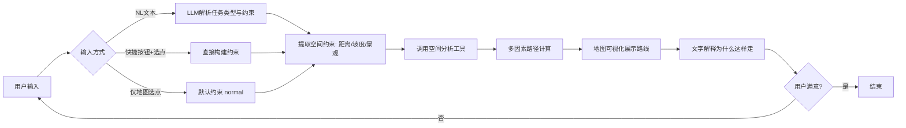

# 01 · 产品需求文档（PRD）

> 产出阶段: Stage 1 · PRD 产品设计
> 角色: Product Manager
> 状态: 待审核（Stage 2 审核后修订版）
> 输入: `00_PROJECT_CONTEXT.md`（已确认）
> 修订记录: 基于 02_PRD_REVIEW.md 的 11 项决策修订

## 1. 产品定位

**产品名称**：漫步珞珈 (WHU-Walker)

**为什么做**：武汉大学校园地形复杂（珞珈山、陡坡、樱花季人流），用户需要个性化路线（少爬坡、多看景、避人流），但现有地图产品只给最短路径，无法处理多维偏好。大语言模型已具备自然语言理解和任务规划能力，本项目验证一种新范式：让 LLM 通过 Agent 架构调用 GIS 工具，使普通人通过自然语言完成个性化空间决策。

**给谁用**：所有想在武汉大学校园内找路、逛景点的人。**不预设用户身份**（老人/游客/学生），用户直接通过自然语言或快捷操作描述自己的偏好与约束，系统从中提取空间约束并完成决策。

**解决什么问题**：
1. 用户找不到符合自己需求的路线（少爬坡、多看景），现有地图只给最短路径。
2. 现有地图产品仅优化最短距离，无法处理多维偏好（距离 + 坡度 + 景观）。
3. 校园景点信息分散，用户不知道有什么值得看、何时看、怎么串联。
4. 路线缺乏解释，用户不理解推荐逻辑，信任度低。

**需要什么能力**：自然语言理解、空间约束提取、空间分析工具调用、多因素决策、地图可视化、自然语言解释。

## 2. 典型使用模式

> 说明：项目上下文明确"不预设用户身份、不引入用户画像"。本节为**使用模式分类**而非用户分群，用于覆盖典型使用场景。系统不区分用户是谁，只看输入需求。

| 使用模式 | 典型需求 | 痛点 |
|---|---|---|
| 校园访客（陌生） | 第一次来武大，想逛标志性景点，找一条走得动的路 | 不熟地形，怕绕路、怕爬大坡；不知道哪些景点值得看 |
| 在校学生（带朋友逛） | 带朋友逛校园、走不熟悉的路线、找风景更好的走法 | 现有地图只给最短路径，不考虑爬坡/景观偏好 |
| 体力受限者 | 需要平坦、缓慢的路线 | 按最短路径走会遇到陡坡，体验差甚至走不动 |
| 季节性访客 | 按花期/季节看景（樱花、桂花） | 不知道哪个季节看什么、如何串联 |

## 3. 用户痛点

1. **找不到符合自己需求的路线**：用户想要"少爬坡、多看景"这类个性化路线，但现有地图产品只给最短路径。现状后果：体力受限者按最短路径走会遇到陡坡；游客想看景却被引导走大路。
2. **现有地图只优化距离**：Google/高德等地图默认最短路径，无法处理"少爬坡、多看景"等多维偏好。现状后果：用户得到的路线不符合个性化需求。
3. **景点信息分散**：武大景点（樱花、老图书馆、珞珈山等）信息散落在攻略/论坛中，用户不知道有什么、何时看、怎么串。现状后果：用户需自行搜集整理，决策成本高。
4. **路线缺乏解释**：现有地图只给路线，不解释"为什么这样走"。现状后果：用户不理解推荐逻辑，信任度低，无法判断是否合适自己。

## 4. 核心使用场景

### 场景 1：第一次来武大的访客，想逛标志性景点且走得不太累

> 用户："我第一次来武大，想看看樱花和老图书馆，但膝盖不好不能爬太陡的坡，帮我规划一条路线"

- 系统识别：第一次来（陌生）、樱花 + 老图书馆（POI 约束）、膝盖不好（slope=avoid）、规划路线（路径任务）
- 系统输出：一条经过樱花和老图书馆、避开陡坡的路线，附文字说明"已避开陡坡路段，途经樱花大道和老图书馆，全程约 X 米"
- 同时给出最短路径作为对比，让用户理解差异

### 场景 2：在校学生带朋友逛校园，想走风景更好的路线

> 用户："我从教五要去图书馆，带朋友逛，想走风景好一点的路线，别爬珞珈山"

- 系统识别：教五 → 图书馆（起终点）、避珞珈山（slope=avoid）、风景好（scenery=high）、路径任务
- 系统输出：一条避开珞珈山、途经景观路段的路线，标注"已避开珞珈山路段，优先景观路线，比最短路径多 X 米但风景更好"

### 场景 3：季节性访客按花期赏景，从起点出发

> 用户："3 月想看樱花，从牌坊出发，给我规划一条赏花路线慢慢走"

- 系统识别：樱花（scenery=high）、牌坊（起点）、慢慢走（distance=relaxed）、目标 POI 类型"樱花"
- 系统处理：在起点到樱花聚集区（樱园/樱顶）之间的路网中，优先选择景观值高的路线
- 系统输出：一条经牌坊到樱园区域的慢节奏路线，附"途经 X 处赏樱点"

> **V1 限制**：此场景需起终点明确。若用户仅指定起点 + POI 类型，系统自动选取最近的符合 POI 作为终点。多 POI 串联（途经多个景点不重复）属 TSP 变体，标为 P2，V1 不做。

## 5. 用户流程



**三种输入方式**：
1. **自然语言输入**（核心）：用户打字描述需求，LLM 解析任务类型与约束
2. **快捷模式 + 选点**：用户点选快捷模式按钮（距离优先/平坦优先/赏景优先）+ 地图点击选起终点，系统直接构建约束
3. **仅地图选点**：用户只在地图上选起终点，系统使用默认约束（normal）

## 6. 功能需求

### P0 · 必须拥有（影响产品能否运行）

#### F-001 需求理解与交互入口

- **描述**：提供三种交互入口接收用户需求，解析任务类型、起终点、偏好约束，输出结构化任务意图。
- **输入**：
  - 方式一：中文自然语言文本（≤ 200 字）
  - 方式二：快捷模式按钮（距离优先 / 平坦优先 / 赏景优先）+ 地图点击选起终点
  - 方式三：仅地图点击选起终点（默认约束 normal）
- **输出**：结构化任务意图 = {任务类型, 起点POI/坐标, 终点POI/坐标, 约束维度及等级, 输入方式}
- **业务规则**：
  - NL 输入仅支持中文
  - 任务类型限定为：路径规划 / 景点查询
  - 起终点必须可识别为已知 POI 或武大核心区内坐标
  - 约束维度限定为三类：
    - `distance`: `short` / `medium` / `relaxed`
    - `slope`: `avoid` / `normal` / `any`
    - `scenery`: `high` / `normal` / `any`
  - 快捷模式按钮映射：
    - 距离优先 → distance=short, slope=normal, scenery=normal
    - 平坦优先 → distance=normal, slope=avoid, scenery=normal
    - 赏景优先 → distance=normal, slope=normal, scenery=high
  - 未明示的约束维度取默认值 `normal`
  - 默认权重：景观 > 坡度 > 距离（基于武大校园以景观为核心吸引力的判断，具体数值 Stage 3 TDD 确定）
- **异常情况**：
  - NL 输入为空或非中文 → 返回"请输入中文需求，或使用快捷按钮 + 地图选点"
  - NL 输入超过 200 字 → 截断处理并提示"已截断至 200 字"
  - 无法识别起终点 → 返回"未识别到起点/终点，请在地图上点击选择，或补充说明（如'从牌坊到樱顶'）"
  - 任务类型不在支持范围 → 返回"目前仅支持路径规划与景点查询"
  - 地图选点超出校园范围 → 提示"选点超出校园核心区，请重新选择"
- **验收标准**：
  - 15 条标准测试 query（见附录 A）中，≥ 80% 能正确提取任务类型与三类约束维度（人工核验）
  - 3 个快捷模式按钮均能正确映射到对应约束等级
  - 地图点击选点精度在 10 米以内

#### F-002 POI 识别与坐标映射

- **描述**：将自然语言中的地名或地图选点映射到武大校园内坐标，并附带 POI 元数据。
- **输入**：地名文本（如"樱顶"、"老图书馆"）或地图点击坐标
- **输出**：{POI ID, 经度, 纬度, POI 类型, POI 描述, 别名列表, 季节标签}
- **业务规则**：
  - 内置武大核心区 POI 映射表（V1 硬编码，至少 12 个 POI）
  - POI 数据结构定义（见附录 B）
  - 支持模糊匹配（"樱花大道" → 命中"樱园 / 樱顶"）
  - POI 类型至少包括：`landmark` / `scenery` / `study`
- **异常情况**：
  - 地名不在映射表 → 返回"未找到该地点，请在地图上点击选择"
  - 地名歧义（如"图书馆"可能指总图书馆或院系图书馆）→ 默认取主图书馆，并提示"已匹配到总图书馆，如需其他可补充说明"
  - 地名疑似拼写错误 → 返回相近候选列表供用户选择
- **验收标准**：
  - 内置 POI（≥ 12 个）全部可被精确匹配
  - ≥ 3 个模糊地名可被消歧（如"樱花大道"、"老图"、"山顶"）
  - 地图选点可正确匹配到最近 POI（10 米以内）

#### F-003 多因素路径规划

- **描述**：基于用户约束（距离 + 坡度 + 景观），在校园路网上生成推荐路线。
- **输入**：起点坐标、终点坐标、三类约束等级
- **输出**：推荐路线（坐标序列） + 总距离 + 各因素分项成本 + 途经 POI 列表 + 最短路径（对比基线）
- **业务规则**：
  - 路线必须连通且位于武大核心区路网内
  - 多因素成本函数 = 距离成本 × w_d + 坡度成本 × w_s + 景观成本 × w_c（权重由约束等级动态调整）
  - 默认权重：景观 > 坡度 > 距离（w_c > w_s > w_d）
  - V1 数据方案：
    - 距离：取路段实际长度（OSM 路网数据）
    - 坡度：手动标注每条路段的坡度等级（1-5 级，1=平坦，5=陡坡），由熟悉校园的开发者标注
    - 景观：手动标注每条路段的景观评分（1-5 级，1=无景观，5=核心景观路段），由熟悉校园的开发者标注
  - 数据标注规范（见附录 C）
  - 同时输出最短路径作为对比基线
  - 路线途经的 POI 自动加入"途经景点"列表
- **异常情况**：
  - 起终点不可达（路网断开）→ 返回"该区域路网不可达，请尝试附近地点"
  - 路线超出校园范围 → 截断并提示"路线已截断至校园核心区"
  - 坡度/景观数据不可用 → 降级为仅距离成本，并在解释中标注
- **验收标准**：
  - 15 条 query 中，多因素路径与最短路径重叠率 ≤ 70%（基于手动标注的真实坡度/景观数据计算）
  - 连续 15 条 query 端到端无崩溃、无超时（P50 ≤ 15 秒/条，热启动）
  - 起终点不可达时正确返回兜底提示，不抛原始错误

#### F-004 地图可视化

- **描述**：在地图上展示推荐路线、最短路径对比、起终点、途经景点。
- **输入**：路线坐标序列、起终点、途经 POI 列表
- **输出**：地图渲染（推荐路线主色 + 最短路径对比色 + 起终点标记 + POI 标记）
- **技术约束**：底图方案待 Stage 3 TDD 确定，要求满足：(1) 中文标注完整 (2) 建筑轮廓可见 (3) 支持手机触摸交互 (4) 免费或低成本 (5) 高德 API 接入需兼容主流移动端和桌面端浏览器。候选方案：高德 JS API / OSM + Leaflet.js。
- **业务规则**：
  - 双端适配（手机触摸可缩放/拖动，桌面布局正常）
  - 支持 PWA 添加到主屏幕
  - 推荐路线与最短路径必须用不同颜色区分
- **异常情况**：
  - 地图底图加载失败 → 显示路线文字描述（坐标序列 + 距离）作为兜底
- **验收标准**：
  - 双端测试通过（设备清单见附录 D）
  - 路线在地图上完整可见、可交互
  - 推荐路线与最短路径视觉可区分

#### F-005 路线解释

- **描述**：用自然语言解释为什么推荐这条路线。
- **输入**：推荐路线、最短路径、约束、各因素分项成本
- **输出**：中文解释文本（≤ 150 字），包含：途经景点、避开的路段、与最短路径的差异
- **业务规则**：
  - 必须显式回应用户提到的约束（如"已避开陡坡"、"已优先景观"）
  - 必须列出途经的主要景点（≥ 1 个）
  - 必须说明与最短路径的差异（多走多少米、避开了什么）
- **异常情况**：
  - 解释生成失败 → 返回模板化兜底说明（"已根据您的偏好规划路线，途经 X、Y，比最短路径多 Z 米"）
- **验收标准**：
  - ≥ 3/5 人认为解释"符合预期且易于理解"（3 条 query 试用打分，打分维度 1-5 分）
  - 15 条 query 中 ≥ 80% 的解释显式回应用户约束

### P1 · 重要功能（提升体验）

#### F-006 景点信息查询

- **描述**：用户询问某个景点的信息（位置、描述、类型、季节标签）。
- **输入**：景点名称
- **输出**：{经纬度, 类型, 描述, 季节标签}
- **业务规则**：仅支持内置 POI 集合
- **异常情况**：景点不在内置列表 → 返回候选列表
- **验收标准**：内置 POI 全部可查；不在列表的景点返回合理候选

#### F-007 路线对比展示

- **描述**：在地图上同时展示推荐路线与最短路径，让用户对比差异。
- **输入**：推荐路线 + 最短路径（两条坐标序列）
- **输出**：地图渲染（两条不同颜色路线 + 各自距离标注）
- **业务规则**：两条路线必须颜色可区分；可在地图上同时叠加显示
- **异常情况**：两条路线重合度 > 90% → 仅显示推荐路线并提示"本次推荐与最短路径基本一致"
- **验收标准**：用户可清晰分辨两条路线；重合度过高时正确提示

#### F-008 多轮对话

- **描述**：用户基于上一次结果继续询问（如"换一条更平坦的"、"太长了，缩短一点"）。
- **输入**：上轮上下文（3 轮） + 新需求
- **输出**：调整后的路线
- **业务规则**：
  - 保留最近 3 轮上下文
  - 支持指代理解（"换一条"指上一轮的路线，"更平坦"指调整 slope 约束）
  - 支持约束微调（距离/坡度/景观均可基于上轮调整）
- **异常情况**：
  - 上下文超过 3 轮 → 仅保留最近 3 轮
  - 指代不明确 → 返回"请明确您想调整的偏好（如距离、坡度、景观）"
- **验收标准**：3 轮内可基于上下文调整路线；指代理解正确率 ≥ 80%

### P2 · 后续功能（可延期）

#### F-009 用户偏好记忆

- **描述**：记住用户的会话级偏好（如"总是避开爬坡"），存储在 localStorage，不涉及账号系统。
- **输入**：用户偏好声明（会话级）
- **输出**：默认约束集
- **验收标准**：后续 query 自动应用偏好；与"无用户画像"原则不冲突（仅存偏好，不存身份）

#### F-010 多语言支持

- **描述**：支持英文输入。
- **输入**：英文自然语言
- **输出**：同 F-001
- **验收标准**：英文输入可被正确解析

## 7. MVP 范围

### 第一版做什么

- F-001 需求理解与交互入口（NL + 快捷按钮 + 地图选点）
- F-002 POI 识别（≥ 12 个内置 POI）
- F-003 多因素路径规划（距离 + 坡度 + 景观，手动标注数据）
- F-004 地图可视化（双端 + PWA）
- F-005 路线解释
- F-006 景点信息查询
- F-007 路线对比展示
- F-008 多轮对话（3 轮上下文 + 指代理解）

### 第一版不做什么（含原因）

| 不做的功能 | 原因 |
|---|---|
| F-009 用户偏好记忆 | 会话级记忆可做，长期偏好留 P2 |
| F-010 多语言支持 | 项目上下文明确"仅支持中文自然语言输入" |
| 城市尺度扩展 | V1 仅限武大校园核心区域 |
| 多用户并发 | 研究原型，不支持 |
| 实时路况 | V1 不引入实时数据源 |
| 用户账号系统 | 与"无用户画像"原则冲突 |
| 高精度 DEM 坡度分析 | V1 使用手动标注坡度数据，不依赖 DEM |
| 缓冲区分析、邻近查询等高级 GIS | V1 范围限定为路径规划 + 多因素成本优化 |
| 离线模式 | V1 依赖在线 LLM 与地图服务 |

## 8. 验收标准（整体，可核对）

- [ ] 约束提取准确率 ≥ 80%（附录 A 的 15 条标准 query 人工核验任务类型 + 三类约束维度）
- [ ] 多因素路径与最短路径重叠率 ≤ 70%（15 条 query 计算，基于手动标注数据）
- [ ] ≥ 3/5 人认为路线"符合预期"（3 条 query 试用打分，1-5 分，≥ 4 分为通过）
- [ ] 连续 15 条 query 端到端无崩溃、无超时（P50 ≤ 15 秒/条，热启动；冷启动 ≤ 30 秒）
- [ ] 双端测试通过（附录 D 设备清单：iPhone Safari + Android Chrome + Chrome/Firefox/Edge 桌面端）
- [ ] 内置 ≥ 12 个 POI 全部可被识别与查询
- [ ] 推荐路线附自然语言解释（显式回应用户约束 + 列出途经景点 + 说明与最短路径差异）
- [ ] 公网链接可访问，PWA 可添加到主屏幕（冷启动首次访问 ≤ 30 秒）
- [ ] 3 个快捷模式按钮（距离优先/平坦优先/赏景优先）均能正确映射约束并生成路线
- [ ] 地图点击选点功能正常，精度 10 米以内
- [ ] F-008 多轮对话 3 轮内可基于上下文调整路线，指代理解正确率 ≥ 80%
- [ ] 附录 E 的 6 个异常场景均有友好兜底，不抛原始错误

## 9. 竞品差异化声明

| 维度 | 高德地图 | 小红书攻略 | 智慧珞珈小程序 | 漫步珞珈（本项目） |
|---|---|---|---|---|
| 交互方式 | 点击选点 + 搜索 | 图文浏览 | 菜单点击 | **NL 输入 + 快捷按钮 + 地图选点** |
| 路径优化 | 仅最短距离 | 无路径规划 | 仅静态推荐 | **多因素（距离+坡度+景观）** |
| 路线解释 | 无 | 无 | 无 | **自然语言解释为什么这样走** |
| 个性化 | 无 | 无 | 无 | **根据用户约束动态生成** |
| 校园覆盖 | 通用地图 | 部分攻略 | 基础信息 | **武大校园路网 + 手动标注数据** |

**3 个能碾压的维度**：
1. **自然语言交互**：直接说需求，不用学操作（vs 高德/智慧珞珈的菜单操作）
2. **多因素路径优化**：距离 + 坡度 + 景观三因子，不是只有最短（vs 高德仅距离）
3. **路线解释**：告诉用户为什么这样走，建立信任（vs 所有竞品都无解释）

## 10. UI/UX 设计规范基线

> 本节为 Stage 3 TDD 定基线，不做像素级设计。详细设计使用 frontend-design skill 在 Stage 3 完成。

### 10.1 首页布局结构

- 顶部输入区：NL 输入框 + 3 个快捷模式按钮（距离优先/平坦优先/赏景优先）
- 主区域：地图（占据 60% 视口高度）
- 底部结果区：路线信息 + 解释文本（可折叠）

### 10.2 状态规范

**4 类 Loading 状态**：
1. 解析中："正在理解您的需求…"（NL 输入后，LLM 调用中）
2. 计算中："正在规划最佳路线…"（路径计算中）
3. 渲染中："正在绘制路线…"（地图渲染中）
4. 冷启动："服务正在唤醒，请稍候…"（首次访问，≤ 30 秒）

**5 类 Error 状态**：
1. 未识别起终点："未识别到起点/终点，请在地图上点击选择"
2. 路网不可达："该区域路网不可达，请尝试附近地点"
3. LLM 异常："理解服务暂时不可用，请使用快捷按钮 + 地图选点"
4. Key 错误："地图服务配置异常，请联系管理员"
5. 超时："请求超时，请重试或使用快捷按钮"

### 10.3 触摸与视觉规范

- 触摸目标 ≥ 44×44px（WCAG AA 标准）
- 路线颜色：推荐路线蓝色实线，最短路径灰色虚线（色盲友好）
- 起终点标记：起点绿色圆点，终点红色圆点
- POI 标记：按类型分色（landmark 橙色 / scenery 粉色 / study 蓝色）

### 10.4 响应式断点

| 断点 | 宽度 | 布局 |
|---|---|---|
| 手机竖屏 | ≤ 375px | 输入区在顶部，地图全宽，结果区底部抽屉 |
| 平板 | 768px | 输入区 + 地图左右分栏 |
| 桌面 | 1024px | 三栏：输入区左 + 地图中 + 结果区右 |
| 宽屏 | ≥ 1440px | 三栏，地图区域扩大 |

## 11. 非功能需求

### 11.1 性能

- 热启动 P50 ≤ 15 秒（含 LLM + GIS + 渲染）
- 冷启动首次访问 ≤ 30 秒（Render 休眠唤醒）
- LLM 服务需支持国内低延迟访问，单次调用 P95 ≤ 3 秒
- OSM 路网首次下载后需缓存，二次访问路径计算 < 1 秒

### 11.2 开发者体验（DX）

- 开发者必须 15 分钟内从 git clone 跑到 Hello World
- 需提供完整的 README（含安装步骤、环境变量配置、启动命令）
- 需提供 dev/prod 环境配置开关

### 11.3 兼容性

- 高德 API 接入需兼容主流移动端（iOS Safari、Android Chrome）和桌面端（Chrome、Firefox、Edge）
- LLM 输出 JSON 的 P99 格式错误率 < 1%（否则路线解析失败）
- CORS/跨域策略需在部署阶段正确配置

---

## 附录 A：15 条标准测试 Query

| # | Query | 期望任务类型 | 期望约束 | 边界类型 |
|---|---|---|---|---|
| 1 | 从牌坊到樱顶，避开陡坡 | 路径规划 | slope=avoid | 正常 |
| 2 | 我第一次来武大，想看樱花和老图书馆，但膝盖不好不能爬太陡的坡，帮我规划一条路线 | 路径规划 | slope=avoid, scenery=high | 正常 |
| 3 | 从教五要去图书馆，带朋友逛，想走风景好一点的路线，别爬珞珈山 | 路径规划 | slope=avoid, scenery=high | 正常 |
| 4 | 3月想看樱花，从牌坊出发，给我规划一条赏花路线慢慢走 | 路径规划 | scenery=high, distance=relaxed | 正常 |
| 5 | 从工学部到信息学部，走风景好的路 | 路径规划 | scenery=high | 正常 |
| 6 | 老人带孙子逛校园，要平坦的路从校门到珞珈山 | 路径规划 | slope=avoid | 正常 |
| 7 | 从梅园到桂园，最短路径 | 路径规划 | distance=short | 正常 |
| 8 | 想看老图书馆，怎么走 | 景点查询 | - | 正常 |
| 9 | 从樱花大道到老斋舍，避开人流 | 路径规划 | distance=relaxed | 正常 |
| 10 | 找一条从行政楼到体育馆的平坦路 | 路径规划 | slope=avoid | 正常 |
| 11 | （空输入，直接提交） | - | - | 边界：空输入 |
| 12 | 从鸦鸦山到樱顶 | 路径规划 | - | 边界：生僻地名/错别字 |
| 13 | from gate to cherry blossom | - | - | 边界：英文输入 |
| 14 | 从牌坊到牌坊 | 路径规划 | - | 边界：起终点相同 |
| 15 | 武大食堂哪个好吃 | - | - | 边界：不支持的任务类型 |

## 附录 B：POI 数据结构

```json
{
  "id": "poi_001",
  "name": "樱顶",
  "aliases": ["樱花顶", "樱园顶"],
  "coordinates": {"lng": 114.35, "lat": 30.54},
  "type": "scenery",
  "description": "武汉大学标志性赏樱地点",
  "season_tags": ["spring"],
  "opening_hours": "全天",
  "difficulty_level": 3,
  "slope_nearby": 4,
  "scenery_score": 5
}
```

**字段说明**：
- `id`: POI 唯一标识
- `name`: 标准名称
- `aliases`: 别名列表（用于模糊匹配）
- `coordinates`: 经纬度坐标
- `type`: POI 类型（landmark / scenery / study）
- `description`: 描述文本
- `season_tags`: 季节标签（spring/summer/autumn/winter），V1 可选
- `opening_hours`: 开放时间，V1 可选
- `difficulty_level`: 到达难度（1-5），V1 可选
- `slope_nearby`: 附近坡度等级（1-5），V1 可选
- `scenery_score`: 景观评分（1-5），V1 可选

> V1 必须字段：id, name, aliases, coordinates, type, description。其余字段为预留，可后续补充。

## 附录 C：数据标注规范

### 坡度标注（1-5 级）

| 等级 | 描述 | 示例路段 |
|---|---|---|
| 1 | 平坦，无明显坡度 | 珞瑜路沿线 |
| 2 | 缓坡，可轻松行走 | 樱花大道部分路段 |
| 3 | 中等坡度，需注意 | 珞珈山路部分路段 |
| 4 | 较陡，体力受限者困难 | 通往樱顶的部分台阶路 |
| 5 | 陡坡，多数人需休息 | 珞珈山陡峭台阶 |

### 景观标注（1-5 级）

| 等级 | 描述 | 示例路段 |
|---|---|---|
| 1 | 无景观，普通道路 | 教学楼间普通道路 |
| 2 | 有少量绿化 | 有行道树的道路 |
| 3 | 有景观但不突出 | 经过小型绿地 |
| 4 | 景观较好 | 经过樱花大道、珞珈山脚 |
| 5 | 核心景观路段 | 樱顶周边、老图书馆周边 |

> 标注由熟悉武大校园的开发者完成，覆盖武大核心区主要路段。

## 附录 D：双端测试设备清单

| 平台 | 浏览器 | 版本要求 |
|---|---|---|
| iPhone | Safari | iOS 16+ |
| Android | Chrome | Android 12+ |
| 桌面 | Chrome | 最新版 |
| 桌面 | Firefox | 最新版 |
| 桌面 | Edge | 最新版 |

> 测试项：地图触摸交互、路线渲染、PWA 安装、NL 输入、快捷按钮、地图选点。

## 附录 E：异常场景测试清单

| # | 异常场景 | 触发方式 | 期望兜底 |
|---|---|---|---|
| 1 | 起终点未识别 | 输入不含可识别地名 | "未识别到起点/终点，请在地图上点击选择" |
| 2 | LLM 返回坏 JSON | 模拟 LLM 返回非 JSON 格式 | 降级为快捷模式 + 默认约束 |
| 3 | 路网不可达 | 选择路网断开的起终点 | "该区域路网不可达，请尝试附近地点" |
| 4 | 高德 Key 错误 | 配置错误的 Key | "地图服务配置异常，请联系管理员" |
| 5 | LLM Key 错误 | 配置错误的 Key | "理解服务暂时不可用，请使用快捷按钮 + 地图选点" |
| 6 | 网络超时 | 模拟网络延迟 > 30 秒 | "请求超时，请重试或使用快捷按钮" |

---

## 待审核说明

- 本 PRD 基于 `00_PROJECT_CONTEXT.md` 已确认内容编写，并依据 `02_PRD_REVIEW.md` 的 11 项决策修订。
- 修订内容：痛点重写、交互入口扩展、数据标注方案、SLA 调整、多轮对话升级、UI/UX 规范基线、DX 约束、竞品声明、POI 数据结构、验收标准补漏洞、用户角色标题调整。
- `00_PROJECT_CONTEXT.md` 中"未确定问题"（OSM 数据覆盖率、地名消歧、权重映射依据）将在 Stage 3 TDD 或后续数据验证阶段处理。
- LLM 选型方向（国内低延迟模型）已由用户确认，具体选型留待 Stage 3 TDD 阶段决策并记录到 `06_DECISIONS.md`。

**等待 Stage 2 复审。**
