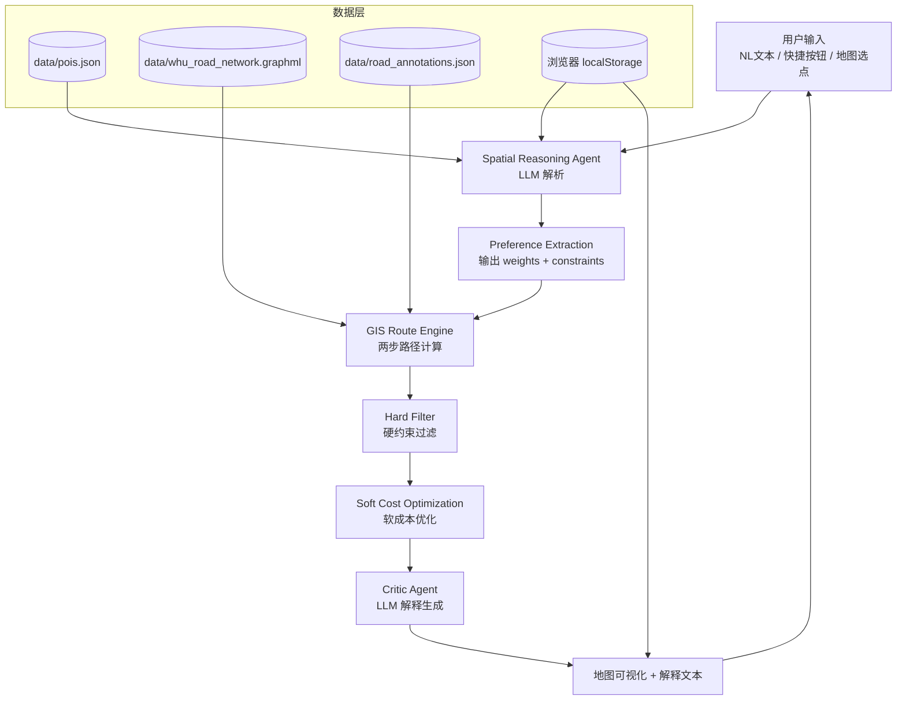

# 03 · 技术设计文档（TDD）

> 产出阶段: Stage 3 · TDD 技术设计
> 角色: System Architect
> 状态: 已完成（基于 01_PRD.md 修订版 + 02_PRD_REVIEW.md 复审 + DEC-001 至 DEC-011 决策）
> 输入: `01_PRD.md`（修订版）、`02_PRD_REVIEW.md`（复审 APPROVED 带 8 项 Notes）、`06_DECISIONS.md`
> 核心研究问题: LLM 能否作为人类空间偏好的转换器，将模糊语言转化为空间计算参数？

---

## 1. 技术目标

| 维度 | 目标 | 来源 |
|---|---|---|
| 性能 · 热启动 | P50 ≤ 15 秒（含 LLM + GIS + 渲染） | PRD §11.1 |
| 性能 · 冷启动 | P50 ≤ 30 秒（Render 休眠唤醒） | PRD §11.1 / DEC-002 |
| 性能 · LLM 单次 | P95 ≤ 3 秒 | DEC-001 / DEC-006 |
| 可靠性 · LLM JSON | P99 格式错误率 < 1% | PRD §11.3 |
| 可靠性 · 路径计算 | 连续 15 条 query 无崩溃、无超时 | PRD §8 |
| 路径差异化 | 多因素路径与最短路径重叠率 ≤ 70% | PRD §8 / DEC-011 |
| 可维护性 · DX | git clone → Hello World ≤ 15 分钟 | PRD §11.2 |
| 兼容性 · 浏览器 | iOS Safari + Android Chrome + Chrome/Firefox/Edge 桌面端 | PRD §11.3 / 附录D |
| 兼容性 · PWA | 可添加到主屏幕 | PRD §8 |

---

## 2. 系统架构

### 2.1 总体架构



### 2.2 核心数据流

```
用户输入
  ↓
[Spatial Reasoning Agent]
  ↓ 输出 {constraints, weights, task_type, start, end}
[Preference Extraction]
  ↓ 输出 {weights: null 或 {w_d, w_s, w_v}, constraints: {distance, slope, scenery}}
[GIS Route Engine]
  ↓ 1. 硬约束过滤（slope=avoid 时过滤 slope_level=5）
  ↓ 2. 软成本优化（Cost = w_d×D + w_s×S + w_v×(1-V)）
  ↓ 输出 {recommended_route, shortest_route, costs, pois}
[Critic Agent]
  ↓ LLM 生成 ≤150 字解释
[地图 + 解释]
```

### 2.3 模块职责

| 模块 | 职责 | 关键技术 |
|---|---|---|
| `app.py` | Flask 入口，注册路由，dev/prod 配置 | Flask |
| `api/routes.py` | RESTful API 路由层 | Flask Blueprint |
| `agents/parser.py` | NL → 任务意图（含 weights + constraints） | DeepSeek + Pydantic |
| `agents/explainer.py` | 路径数据 → 自然语言解释 | DeepSeek + 模板兜底 |
| `spatial/coord_transform.py` | GCJ-02 ⇄ WGS-84 坐标系转换 | 标准算法 |
| `spatial/poi.py` | POI 加载与匹配（模糊匹配 + 消歧） | JSON + 字符串相似度 |
| `spatial/network.py` | OSMnx 路网下载、缓存、加载 | OSMnx + GraphML |
| `spatial/routing.py` | 多因素路径计算（硬约束 + 软成本） | NetworkX + Dijkstra |
| `data/pois.json` | POI 数据存储 | JSON |
| `data/road_annotations.json` | 路段坡度/景观手动标注 | JSON |
| `static/` | 前端资源（HTML/CSS/JS + PWA） | 高德 JS API + 原生 JS |

---

## 3. 技术选型

| 领域 | 选项 | 推荐 | 理由 |
|---|---|---|---|
| 后端框架 | Flask / FastAPI / Django | **Flask** | 项目上下文已确认；轻量、灵活；与现有 `config.py` 兼容 |
| WSGI 服务器 | gunicorn / uWSGI | **gunicorn** | Render 官方推荐，配置简单 |
| LLM 服务 | DeepSeek / 通义千问 / 智谱 GLM | **DeepSeek V4-Flash** | 性价比最高、SLA 达标、OpenAI SDK 兼容（DEC-006） |
| LLM SDK | openai SDK / 原生 HTTP | **openai SDK** | 兼容 DeepSeek API，无需替换 |
| 路网数据 | OSMnx / 高德路径 API | **OSMnx** | 项目上下文已确认；学术可控、可缓存 GraphML |
| 路径算法 | NetworkX Dijkstra / A* | **NetworkX Dijkstra** | V1 路网规模小（80-120 段），Dijkstra 足够 |
| 坐标系转换 | coordTransform_py / pyproj | **coordTransform_py** | 标准 GCJ-02⇄WGS-84 算法，轻量 |
| 数据校验 | Pydantic / marshmallow | **Pydantic v2** | LLM JSON 输出校验 + 重试 |
| 前端地图 | 高德 JS API / OSM+Leaflet | **高德 JS API** | 武大数据覆盖完整、移动端体验好（DEC-007） |
| 前端框架 | 原生 JS / Vue / React | **原生 JS** | V1 简单交互无需框架；PWA 用 Service Worker |
| 数据存储 | JSON 文件 / SQLite / Redis | **JSON + localStorage** | V1 数据量小，无需 DB（DEC-008） |
| 部署 | Render / Vercel / 自建 | **Render** | 项目上下文已确认；免费 + gunicorn |
| PWA | Service Worker + manifest.json | **是** | PRD §8 要求 |
| 测试 | pytest | **pytest** | Python 标准 |

---

## 4. 数据模型

### 4.1 POI 数据结构（`data/pois.json`）

```json
{
  "version": "1.0",
  "pois": [
    {
      "id": "poi_001",
      "name": "樱顶",
      "aliases": ["樱花顶", "樱园顶"],
      "coordinates": {"lng": 114.35, "lat": 30.54},
      "type": "scenery",
      "description": "武汉大学标志性赏樱地点",
      "season_tags": ["spring"],
      "scenery_score": 5
    }
  ]
}
```

**V1 必须字段**：`id`, `name`, `aliases`, `coordinates`, `type`, `description`
**V1 可选字段**：`season_tags`, `opening_hours`, `difficulty_level`, `slope_nearby`, `scenery_score`

**POI 数量**：≥ 15 个（覆盖附录A 15 条 query 涉及的所有地名，复审 N4 应对）

### 4.2 路网标注数据结构（`data/road_annotations.json`）

```json
{
  "version": "1.0",
  "annotator": "武大学生开发者",
  "annotated_at": "2026-08-XX",
  "coverage": "武大核心区 OSM 路网 highway=footway/path",
  "coverage_rate": 0.85,
  "edges": [
    {
      "edge_id": [1142589, 1142590, 0],
      "u": 1142589,
      "v": 1142590,
      "name": "樱花大道（部分）",
      "length_m": 52.3,
      "slope_level": 2,
      "scenery_level": 5,
      "note": "春季樱花盛开，核心景观路段"
    }
  ]
}
```

**覆盖率要求**：≥ 80%（复审 N5 应对）
**标注流程**：见 §11 数据标注流程

### 4.3 路网缓存（`data/whu_road_network.graphml`）

- **首次启动**：OSMnx 下载武大核心区路网（bbox: 30.527-30.545, 114.355-114.375）→ 保存为 GraphML
- **后续启动**：直接加载 GraphML（< 1 秒）
- **edge 属性**：`length`, `slope_level`, `scenery_level`, `name`, `highway`
- **失效条件**：手动删除文件触发重新下载

### 4.4 localStorage 数据结构（前端）

| Key | 用途 | 数据格式 |
|---|---|---|
| `whu_walker:context:{sessionId}` | 多轮对话上下文（F-008） | 最近 3 轮 query + 解析结果 |
| `whu_walker:preferences` | 用户偏好（F-009） | `{distance: "medium", slope: "normal", scenery: "high"}` |

---

## 5. API 设计

### 5.1 端点列表

| 方法 | 路径 | 入参 | 出参 | 错误码 | 用途 |
|---|---|---|---|---|---|
| POST | `/api/parse` | `{query: str}` 或 `{start, end, mode}` | `{task_type, start, end, constraints, weights, input_method}` | 400/500 | NL 解析（独立调用） |
| POST | `/api/route` | `{task_type, start, end, constraints, weights}` | `{recommended, shortest, costs, pois, explanation}` | 400/404/500 | 路径计算（独立调用） |
| POST | `/api/chat` | `{query: str, context?: object}` | `{task_type, ...route_data, context}` | 400/500 | 一站式接口（主流程） |
| GET | `/api/pois` | — | `{pois: [...]}` | 500 | POI 列表 |
| GET | `/api/pois/{name}` | `name` | `{poi}` | 404/500 | 单 POI 查询 |

### 5.2 `/api/parse` 详细设计

**请求**：
```json
{
  "query": "我第一次来武大，想看樱花和老图书馆，但膝盖不好不能爬太陡的坡，帮我规划一条路线",
  "input_method": "nl"
}
```

或快捷按钮模式：
```json
{
  "start": {"name": "牌坊"},
  "end": {"name": "樱顶"},
  "mode": "scenery_priority",
  "input_method": "shortcut"
}
```

**响应**：
```json
{
  "task_type": "path_planning",
  "start": {"name": "牌坊", "type": "poi", "coordinates": {"lng": 114.36, "lat": 30.536}},
  "end": {"name": "樱顶", "type": "poi", "coordinates": {"lng": 114.35, "lat": 30.54}},
  "constraints": {
    "distance": "medium",
    "slope": "avoid",
    "scenery": "high"
  },
  "weights": {
    "distance": 0.1,
    "slope": 0.5,
    "scenery": 0.4
  },
  "input_method": "nl",
  "ambiguity": null
}
```

**`weights` 字段说明**（DEC-010）：
- 用户输入无任何空间偏好 → `weights: null`（后端 fallback 到 `DEFAULT_WEIGHTS`）
- 用户输入有偏好 → `weights: {distance, slope, scenery}`
- 后端校验：每个权重 ∈ [0.05, 0.8]，归一化（总和=1）

### 5.3 场景 3 算法明确（复审 N1 应对）

当用户仅指定起点 + POI 类型（如"3 月想看樱花，从牌坊出发"）：

1. 后端调用 `spatial/poi.py` 查询所有 `type=scenery` 且 `season_tags` 含 `spring` 的 POI
2. 计算每个候选 POI 到起点的路网距离（Dijkstra 最短路径）
3. 路网距离最短的候选作为终点
4. 同距离时（差 ≤ 50 米）取 `scenery_score` 最高的
5. 返回最近 3 个候选让前端展示

---

## 6. 模块划分

```text
campus-spatial-intelligence-agent/
├── app.py                          # Flask 入口（新增）
├── config.py                       # 全局配置（POI 数据迁出）
├── requirements.txt
├── .env.example                    # 环境变量模板（完善）
├── README.md                       # 完整文档（重写）
│
├── agents/                         # LLM Agent 层
│   ├── __init__.py
│   ├── parser.py                   # NL → 任务意图（F-001）
│   ├── explainer.py                # 路线 → 解释文本（F-005）
│   └── prompts/                    # Prompt 模板
│       ├── parse_system.txt
│       └── explain_system.txt
│
├── spatial/                        # GIS 工具层
│   ├── __init__.py
│   ├── coord_transform.py          # GCJ-02 ⇄ WGS-84（新增，DEC-007）
│   ├── poi.py                      # POI 加载与匹配（新增）
│   ├── routing.py                  # 多因素路径计算（新增，DEC-011）
│   └── network.py                  # OSMnx 路网加载与缓存（新增）
│
├── api/                            # API 路由层（新增）
│   ├── __init__.py
│   └── routes.py
│
├── data/                           # 数据文件
│   ├── pois.json                   # POI 数据（新增，DEC-008）
│   ├── road_annotations.json       # 路段标注（Stage 4 新增）
│   └── whu_road_network.graphml    # 路网缓存（运行时生成）
│
├── static/                         # 前端资源（新增）
│   ├── index.html
│   ├── css/
│   ├── js/
│   └── manifest.json               # PWA manifest
│
├── scripts/                        # 工具脚本（新增）
│   ├── export_edges_for_annotation.py
│   └── csv_to_json.py
│
├── tests/                          # 测试
│   ├── test_parser.py
│   ├── test_routing.py
│   └── test_api.py
│
├── project-docs/                   # 项目文档
└── output/                         # 运行输出
```

**目录用途**：
- `agents/`：LLM 调用层，所有 LLM 相关代码集中
- `spatial/`：GIS 工具层，纯函数式，便于单测
- `api/`：薄 API 层，仅做参数校验 + 调用 service
- `data/`：所有数据文件，便于版本控制
- `static/`：前端资源，Flask 静态文件服务
- `scripts/`：开发工具脚本，不参与运行时

---

## 7. 核心算法设计（CSIA 空间效用模型）

### 7.1 算法总览

```text
用户自然语言
  ↓
[Spatial Reasoning Agent]（DEC-010）
  ↓ LLM 解析为 {constraints, weights}
[GIS Route Engine]（DEC-011）
  ↓ 1. 硬约束过滤 → 可行路线集合
  ↓ 2. 软成本优化 → 最优路线
[Critic Agent]
  ↓ LLM 生成解释
地图 + 解释
```

### 7.2 三因素成本函数

```
Cost(edge) = w_d × D(edge) + w_s × S(edge) + w_v × (1 − V(edge))
```

| 变量 | 含义 | 取值范围 | 归一化方式 |
|---|---|---|---|
| `D(edge)` | 距离成本 | [0, 1] | `length / max_length_in_network` |
| `S(edge)` | 坡度成本 | [0, 1] | `slope_level / 5` |
| `V(edge)` | 景观收益 | [0, 1] | `scenery_level / 5` |
| `w_d` | 距离权重 | [0.05, 0.8] | LLM 输出或默认 |
| `w_s` | 坡度权重 | [0.05, 0.8] | LLM 输出或默认 |
| `w_v` | 景观权重 | [0.05, 0.8] | LLM 输出或默认 |

**关键设计**：景观作为"收益"取 `1-V` 转化为成本，三指标方向统一为"越小越好"。

### 7.3 默认权重（DEC-004 修订）

```python
DEFAULT_WEIGHTS = {
    "distance": 0.5,   # 距离作为基础（默认场景接近普通导航）
    "slope":    0.2,   # 坡度权重低（武大主要活动区相对平坦）
    "scenery":  0.3,   # 景观权重适中
}
```

### 7.4 权重生成与校验（DEC-010）

```python
def resolve_weights(llm_weights):
    """解析 LLM 输出的 weights，校验后返回最终权重"""
    if llm_weights is None:
        return DEFAULT_WEIGHTS  # 无偏好 → 默认
    
    # 校验：每个权重 ∈ [0.05, 0.8]
    w = {k: max(0.05, min(0.8, float(v))) 
         for k, v in llm_weights.items()}
    
    # 归一化：总和 = 1
    total = sum(w.values())
    if total == 0:
        return DEFAULT_WEIGHTS
    return {k: v / total for k, v in w.items()}
```

### 7.5 硬约束过滤（DEC-011）

```python
def filter_by_constraints(G, constraints):
    """基于硬约束过滤不可通行路段"""
    if constraints.get("slope") == "avoid":
        # 过滤 slope_level=5 的路段
        edges_to_remove = [
            (u, v, k) for u, v, k, data in G.edges(data=True, keys=True)
            if data.get("slope_level") == 5
        ]
        G_filtered = G.copy()
        G_filtered.remove_edges_from(edges_to_remove)
        
        # 兜底：若无可行路径，放宽到 slope_level=4 也可通行
        if not nx.is_connected(G_filtered):
            return G, "degraded_slope"  # 返回原图 + 降级标记
        return G_filtered, "filtered"
    return G, "no_filter"
```

### 7.6 路径计算流程

```python
def compute_route(G, start, end, constraints, weights):
    # Step 1: 硬约束过滤
    G_filtered, filter_status = filter_by_constraints(G, constraints)
    
    # Step 2: 软成本优化（Dijkstra）
    def edge_weight(u, v, data):
        return (
            weights["distance"] * normalize_length(data["length"])
            + weights["slope"] * (data.get("slope_level", 3) / 5)
            + weights["scenery"] * (1 - data.get("scenery_level", 3) / 5)
        )
    
    recommended = nx.dijkstra_path(G_filtered, start, end, weight=edge_weight)
    shortest = nx.dijkstra_path(G, start, end, weight="length")  # 最短路径基线
    
    return {
        "recommended": recommended,
        "shortest": shortest,
        "filter_status": filter_status,
        "overlap_rate": compute_overlap(recommended, shortest)
    }
```

### 7.7 降级策略（复审 N6 应对）

```python
def get_edge_cost(edge, weights):
    """处理路段缺标注的降级"""
    slope = edge.get("slope_level")
    scenery = edge.get("scenery_level")
    
    if slope is None or scenery is None:
        # 降级模式：仅距离成本
        return weights["distance"] * normalize_length(edge), "degraded"
    
    # 完整模式
    return (
        weights["distance"] * normalize_length(edge)
        + weights["slope"] * (slope / 5)
        + weights["scenery"] * (1 - scenery / 5)
    ), "full"
```

**触发条件**：路段缺标注（标注覆盖率不足时）或路网扩展到未标注区域。
**降级标记**：在解释文本中标注"部分路段缺标注数据，仅按距离推荐"。

---

## 8. Prompt 工程

### 8.1 任务解析 Prompt（F-001）

**System Prompt**：
```
你是漫步珞珈的空间偏好解析助手。用户会用中文描述在武大校园的路径需求。
你的任务是将自然语言转化为结构化空间偏好，输出严格 JSON。

任务类型限定为：
- "path_planning"（路径规划）
- "poi_query"（景点查询）

约束等级（硬约束）：
- distance: short | medium | relaxed
- slope: avoid | normal | any
- scenery: high | normal | any

权重（软成本）：
- 若用户输入无任何空间偏好表述 → weights: null
- 若用户表达了偏好 → 输出 weights: {distance, slope, scenery}
- 每个权重范围 [0.05, 0.8]，无需归一化（后端处理）

POI 列表（用于起终点识别）：
{poi_list_json}

输出格式：
{
  "task_type": "path_planning",
  "start": {"name": "...", "type": "poi"},
  "end": {"name": "...", "type": "poi"},
  "constraints": {"distance": "medium", "slope": "normal", "scenery": "normal"},
  "weights": null,
  "input_method": "nl",
  "ambiguity": null
}

Few-shot 例子：

输入："从牌坊到樱顶"
输出：{"task_type": "path_planning", "start": {"name": "牌坊", "type": "poi"}, "end": {"name": "樱顶", "type": "poi"}, "constraints": {"distance": "medium", "slope": "normal", "scenery": "normal"}, "weights": null, "input_method": "nl", "ambiguity": null}

输入："从牌坊到樱顶，避开陡坡"
输出：{"task_type": "path_planning", "start": {"name": "牌坊", "type": "poi"}, "end": {"name": "樱顶", "type": "poi"}, "constraints": {"distance": "medium", "slope": "avoid", "scenery": "normal"}, "weights": {"distance": 0.2, "slope": 0.6, "scenery": 0.2}, "input_method": "nl", "ambiguity": null}

输入："我第一次来武大，想看樱花和老图书馆，但膝盖不好"
输出：{"task_type": "path_planning", "start": null, "end": null, "constraints": {"distance": "medium", "slope": "avoid", "scenery": "high"}, "weights": {"distance": 0.1, "slope": 0.5, "scenery": 0.4}, "input_method": "nl", "ambiguity": "请指定起点"}

输入："从梅园到桂园，最短路径"
输出：{"task_type": "path_planning", "start": {"name": "梅园", "type": "poi"}, "end": {"name": "桂园", "type": "poi"}, "constraints": {"distance": "short", "slope": "normal", "scenery": "normal"}, "weights": {"distance": 0.8, "slope": 0.1, "scenery": 0.1}, "input_method": "nl", "ambiguity": null}

输入："带朋友逛，从教五去图书馆，走风景好的路"
输出：{"task_type": "path_planning", "start": {"name": "教五", "type": "poi"}, "end": {"name": "图书馆", "type": "poi"}, "constraints": {"distance": "medium", "slope": "normal", "scenery": "high"}, "weights": {"distance": 0.2, "slope": 0.1, "scenery": 0.7}, "input_method": "nl", "ambiguity": null}
```

### 8.2 解释生成 Prompt（F-005）

**System Prompt**：
```
你是漫步珞珈的解释生成助手。基于路径数据，生成 ≤150 字的中文解释。

输入：
- 用户约束：{constraints}
- 用户权重：{weights}
- 推荐路线：{route_summary}（距离 X 米，途经 POI 列表）
- 最短路径：{shortest_summary}（距离 Y 米）
- 各因素分项成本：{costs}
- 硬约束过滤状态：{filter_status}

必须包含：
1. 显式回应用户提到的约束（如"已避开陡坡"、"已优先景观"）
2. 列出途经的主要景点（≥ 1 个）
3. 说明与最短路径的差异（多走多少米、避开了什么）

Few-shot：
约束：slope=avoid, scenery=high
路线：1200 米，途经樱顶、老图书馆，过滤了 3 段陡坡
最短：800 米
输出："已避开 3 段陡坡路段，优先景观路线。途经樱顶和老图书馆，比最短路径多 400 米但风景更好。"
```

### 8.3 JSON 输出保障（PRD §11.3 P99 < 1%）

```python
from pydantic import BaseModel, ValidationError
from typing import Optional, Literal

class PoiRef(BaseModel):
    name: str
    type: Literal["poi", "coord"]
    coordinates: Optional[dict]

class Constraints(BaseModel):
    distance: Literal["short", "medium", "relaxed"]
    slope: Literal["avoid", "normal", "any"]
    scenery: Literal["high", "normal", "any"]

class TaskIntent(BaseModel):
    task_type: Literal["path_planning", "poi_query"]
    start: Optional[PoiRef]
    end: Optional[PoiRef]
    constraints: Constraints
    weights: Optional[dict]  # null 或 {distance, slope, scenery}
    input_method: Literal["nl", "shortcut", "map_click"]
    ambiguity: Optional[dict]

def parse_with_retry(query, max_retries=2):
    for attempt in range(max_retries + 1):
        try:
            raw = llm.chat(messages=[...])
            data = extract_json(raw)  # 提取 JSON 子串
            return TaskIntent(**data)
        except (json.JSONDecodeError, ValidationError) as e:
            if attempt == max_retries:
                # 兜底：降级为快捷模式 + 默认约束
                return fallback_to_default(query)
            # 重试：附加格式错误提示
```

---

## 9. 前端设计

### 9.1 设计深度策略

- **TDD 定基线**：组件规范、状态管理、API 集成规范
- **Stage 4 用 frontend-design skill 落地**：详细 HTML/CSS、4 loading、5 error、响应式适配

### 9.2 组件规范

| 组件 | 功能 | 关键交互 |
|---|---|---|
| 输入区 | NL 输入框 + 3 快捷按钮 + 提交 | 输入 ≤ 200 字；按钮高亮态 |
| 地图 | 高德 JS API 封装 | 选点、缩放、路线渲染、POI 标记 |
| 结果区 | 路线信息卡片 + 解释文本（可折叠） | 显示距离、途经 POI、与最短路径对比 |
| Loading | 4 类 loading 状态 | 解析中/计算中/渲染中/冷启动 |
| Error | 5 类 error 状态 | 未识别/路网不可达/LLM 异常/Key 错误/超时 |
| Toast | 短提示 | 截断提示、兜底提示 |

### 9.3 高德 JS API 集成

```javascript
// 异步加载高德 JS API
AMapLoader.load({
  key: AMAP_KEY,
  version: '2.0',
  plugins: ['AMap.Geocoder', 'AMap.Polyline']
}).then(AMap => {
  const map = new AMap.Map('map-container', {
    zoom: 16,
    center: [114.363, 30.5365],  // 武大中心
    mapStyle: 'amap://styles/whitestar'  // 简洁风格
  });
  
  // 路线渲染：推荐路线蓝色实线，最短路径灰色虚线
  const recommendedLine = new AMap.Polyline({
    path: routeCoords,  // GCJ-02 坐标
    strokeColor: '#1976D2',
    strokeWeight: 6,
    strokeStyle: 'solid'
  });
  
  const shortestLine = new AMap.Polyline({
    path: shortestCoords,
    strokeColor: '#9E9E9E',
    strokeWeight: 4,
    strokeStyle: 'dashed'
  });
});
```

### 9.4 PWA 配置（复审 N8 应对）

- **manifest.json**：name、short_name、icons (192/512)、theme_color、display: standalone
- **Service Worker**：
  - 首屏 HTML/JS/CSS：cache-first
  - API 调用：stale-while-revalidate
  - 高德 JS API：network-only（不缓存第三方）
- **离线降级**：网络不可用时显示"网络不可用，请检查连接"
- **icon 资源**：192×192 和 512×512 两个尺寸

---

## 10. 部署方案

### 10.1 环境配置

| 环境 | 用途 | 配置 |
|---|---|---|
| development | 本地开发 | `FLASK_ENV=development`，DEBUG=True |
| production | Render 部署 | `FLASK_ENV=production`，gunicorn 启动 |

### 10.2 环境变量（`.env.example`）

```
# LLM 配置（DEC-006）
DEEPSEEK_API_KEY=sk-xxx
OPENAI_BASE_URL=https://api.deepseek.com/v1
LLM_MODEL=deepseek-chat

# 高德地图（DEC-007）
AMAP_KEY=xxx

# Flask
FLASK_ENV=development
FLASK_PORT=5000

# 路网配置
WHU_BBOX_NORTH=30.545
WHU_BBOX_SOUTH=30.527
WHU_BBOX_EAST=114.375
WHU_BBOX_WEST=114.355
```

### 10.3 部署流程（Render）

1. **GitHub 推送**：`git push origin main`
2. **Render 自动构建**：检测到 push，自动 `pip install -r requirements.txt`
3. **Render 启动命令**：`gunicorn app:app --workers 1 --timeout 60`
4. **首次启动**：自动下载 OSM 路网（首次 2-5 秒），缓存到 GraphML
5. **后续启动**：直接加载 GraphML（< 1 秒）

### 10.4 回滚策略

- Render 自动保留最近 N 次部署
- 通过 Render Dashboard 一键回滚到上一版本

---

## 11. 数据标注流程（DEC-003 落地）

### 11.1 标注步骤

**Step 1 · 生成路段清单**：
```bash
python scripts/export_edges_for_annotation.py
```
输出 `data/edges_to_annotate.json` + `data/edges_map.html`（Folium 可视化）

**Step 2 · 可视化标注**：
- 浏览器打开 `data/edges_map.html`
- 每条路段在地图上显示位置和编号
- 凭武大熟悉度，给每条路段的坡度和景观打 1-5 分

**Step 3 · 批量录入**（推荐 CSV）：
```csv
edge_id,u,v,name,length_m,slope_level,scenery_level,note
"[1142589, 1142590, 0]",1142589,1142590,樱花大道（部分）,52.3,2,5,春季樱花盛开
```

**Step 4 · 转换与加载**：
```bash
python scripts/csv_to_json.py data/road_annotations.csv
```
生成 `data/road_annotations.json`，启动时 merge 到路网 edge 属性。

### 11.2 标注工作量

- **路段数**：约 80-120 条
- **每条标注时间**：30 秒 - 1 分钟
- **总工作量**：约 1-2 小时

### 11.3 验收

- 覆盖率 ≥ 80%（武大核心区 OSM footway/path）
- 附录A 15 条 query 涉及路段全部覆盖
- 樱顶、老图书馆、珞珈山等核心 POI 周边路段全覆盖

---

## 12. 权限设计

V1 为个人项目原型，**无用户账号系统**（PRD §7 不做项）。

- 所有 API 公开访问（无鉴权）
- 用户偏好存储在 localStorage（不涉及账号）
- 多轮对话上下文存储在 localStorage

---

## 13. 安全方案

| 风险 | 应对 |
|---|---|
| LLM API Key 泄露 | Key 存 `.env`，不入 git；后端代理调用，前端不直接调 LLM |
| 高德 Key 前端暴露 | 高德 Key 必须前端暴露（无法避免），设置 Referer 白名单限制域名 |
| XSS 攻击 | LLM 输出经 Pydantic 校验；解释文本用 `textContent` 而非 `innerHTML` |
| CSRF | POST API 校验 `Content-Type: application/json`；不用 cookie |
| 输入注入 | NL 输入 ≤ 200 字截断；参数化查询（无 SQL 注入风险，V1 无 DB） |
| CORS | `flask-cors` 配置允许的 Origin（dev: localhost；prod: Render 域名） |

---

## 14. 技术风险 + 应对

| # | 风险 | 影响 | 应对 | 来源 |
|---|---|---|---|---|
| R1 | LLM 输出 JSON 格式错误 | 路径解析失败 | Pydantic 校验 + 2 次重试 + 兜底快捷模式 | PRD §11.3 |
| R2 | LLM 输出 weights 极端值 | 路径偏离用户预期 | 后端校验 [0.05, 0.8] + 归一化 | DEC-010 |
| R3 | OSM 武大校园路网缺失 | 路径不连通 | 手动补段；或降级为高德路径 API | 00_CONTEXT 已知风险 |
| R4 | 坐标系不一致（GCJ-02 vs WGS-84） | 路线偏离 50-200 米 | `spatial/coord_transform.py` 边界转换 | DEC-007 |
| R5 | 标注覆盖率不足 | 部分路段降级为仅距离成本 | 兜底逻辑 + 解释标注 | 复审 N6 |
| R6 | Render 冷启动 > 30 秒 | PWA 体验差 | 热门 query LLM 响应缓存；Service Worker 缓存首屏 | PRD §11.1 |
| R7 | 高德 API 配额耗尽 | 地图无法加载 | 个人开发者每日 30 万次，V1 流量远低于此 | DEC-007 |
| R8 | LLM 两次串行调用超 SLA | 端到端 > 15 秒 | DeepSeek 国内低延迟；缓存 system prompt | DEC-001/006 |

---

## 15. 复审 8 项 Notes 应对汇总

| Note | 应对方案 | 落实位置 |
|---|---|---|
| **N1** 场景3 算法不明确 | §5.3 明确：起点 + POI 类型时，路网距离最短 + scenery_score 最高 | §5.3 + `spatial/routing.py` |
| **N2** 快捷按钮与默认权重协同 | DEC-010 LLM 直接生成权重；快捷按钮触发 LLM 生成对应权重 | DEC-010 + Prompt few-shot |
| **N3** crowd 维度缺失 | V1 简化方案：将"避开人流"映射为 distance=relaxed；解释中说明"已选相对清静路线" | Prompt 规则 |
| **N4** POI 数量下限 | §4.1 POI ≥ 15 个，覆盖附录A 所有地名 | `data/pois.json` |
| **N5** 标注覆盖率未量化 | §11.3 覆盖率 ≥ 80%，预估 80-120 段 | §11 + `data/road_annotations.json` |
| **N6** F-003 降级触发条件 | §7.7 缺标注路段降级为仅距离成本 + 解释标注 | §7.7 + `spatial/routing.py` |
| **N7** F-008 指代理解测试集 | §16 验收测试集：10 条多轮对话测试集，80% 通过线 | §16 |
| **N8** PWA 验收技术指标 | §9.4 manifest + Service Worker + 离线降级 + icon 资源 | §9.4 |

---

## 16. 验收测试集

### 16.1 NL 解析测试（PRD 附录A 15 条 query）

- 每条 query 期望输出 `task_type` + `constraints` + `weights`
- 通过线：≥ 80%（12/15）

### 16.2 多轮对话测试（复审 N7 应对）

构造 10 条多轮对话测试集：

| # | 上轮 | 当前轮 | 期望行为 |
|---|---|---|---|
| 1 | 从牌坊到樱顶 | 换一条更平坦的 | 调整 slope 约束 + 重新规划 |
| 2 | 从牌坊到樱顶 | 太长了，缩短一点 | 调整 distance 约束 + 重新规划 |
| 3 | 从教五到图书馆 | 风景更好一点 | 调整 scenery 约束 + 重新规划 |
| 4 | 从牌坊到樱顶 | 换个起点，从梅园出发 | 替换起点 + 重新规划 |
| 5 | 从牌坊到樱顶 | 终点改为老图书馆 | 替换终点 + 重新规划 |
| 6 | 从牌坊到樱顶 | 还是刚才那条好 | 回滚到上轮路线 |
| 7 | 从梅园到桂园 | 不要爬坡 | 增加 slope=avoid 约束 |
| 8 | 从工学部到信息学部 | 走风景好的路 | 增加 scenery=high 约束 |
| 9 | 从牌坊到樱顶 | 我说的更平坦 | 指代理解（指 slope） |
| 10 | 从牌坊到樱顶 | 那个太远了 | 指代理解（指 distance） |

- 通过线：≥ 80%（8/10）

### 16.3 异常场景测试（PRD 附录E 6 项）

- 6 个异常场景均有友好兜底，不抛原始错误

### 16.4 双端测试（PRD 附录D）

- iPhone Safari + Android Chrome + Chrome/Firefox/Edge 桌面端

---

## 17. DX · Hello World 流程（PRD §11.2）

### 17.1 15 分钟 Hello World 步骤

```bash
# 1. 克隆项目（< 1 分钟）
git clone https://github.com/xxx/campus-spatial-intelligence-agent.git
cd campus-spatial-intelligence-agent

# 2. 创建虚拟环境（1 分钟）
python -m venv venv
venv\Scripts\activate  # Windows
# source venv/bin/activate  # Linux/Mac

# 3. 安装依赖（3-5 分钟）
pip install -r requirements.txt

# 4. 配置环境变量（2 分钟）
cp .env.example .env
# 编辑 .env 填入 DEEPSEEK_API_KEY 和 AMAP_KEY

# 5. 启动（首次 3-5 分钟，含 OSM 路网下载）
python app.py

# 6. 浏览器访问
# http://localhost:5000
```

### 17.2 README.md 必含内容

- 项目简介
- 环境要求（Python 3.10+）
- 安装步骤
- 环境变量配置说明
- 启动命令
- 常见问题（OSM 首次下载、Key 配置、CORS）
- dev/prod 配置开关

---

## 18. 待办事项

### Stage 3 完成后立即开始

- [ ] 创建 `app.py` 入口
- [ ] 创建 `api/routes.py` 5 个端点骨架
- [ ] 创建 `agents/parser.py` + `agents/explainer.py` 骨架
- [ ] 创建 `spatial/coord_transform.py` 坐标系转换
- [ ] 创建 `spatial/poi.py` POI 加载与匹配
- [ ] 创建 `spatial/network.py` OSMnx 路网加载
- [ ] 创建 `spatial/routing.py` 多因素路径计算
- [ ] 迁移 `config.py` POI 数据到 `data/pois.json`
- [ ] 重写 `README.md`
- [ ] 完善 `.env.example`

### Stage 4 任务

- [ ] 用 frontend-design skill 产出前端 HTML/CSS
- [ ] 手动标注 80-120 路段坡度/景观（用户完成）
- [ ] 端到端测试 15 条 query
- [ ] 双端测试（5 个浏览器）
- [ ] 部署到 Render

---

## 19. 设计总结

### 19.1 核心研究问题

**LLM 能否作为人类空间偏好的转换器，将模糊语言转化为空间计算参数？**

### 19.2 核心架构链路

```
用户自然语言
  ↓
LLM（Spatial Reasoning Agent）
  ↓ 输出 {weights, constraints}
GIS 空间优化模型
  ↓ 硬约束过滤 + 软成本优化
最优路径
  ↓
LLM（Critic Agent）
  ↓ 生成解释
地图 + 解释
```

### 19.3 方法创新点

1. **LLM 直接生成空间效用权重**（DEC-010）：而非规则系统映射，体现 LLM → 空间认知 → GIS 决策 的核心研究链路
2. **约束与权重分离**（DEC-011）：硬约束过滤 + 软成本优化，标准优化思想
3. **景观作为收益取 1-V**：三指标方向统一为"越小越好"，数学上更优雅
4. **null fallback 机制**：无偏好时用默认权重，保证默认场景稳定性

---

> 本 TDD 基于 `01_PRD.md`（修订版）+ `02_PRD_REVIEW.md`（复审 APPROVED 带 8 项 Notes）+ `06_DECISIONS.md`（DEC-001 至 DEC-011）编写。
> 所有技术决策已记录在 `06_DECISIONS.md`，可在 Stage 4 实施时追溯。
