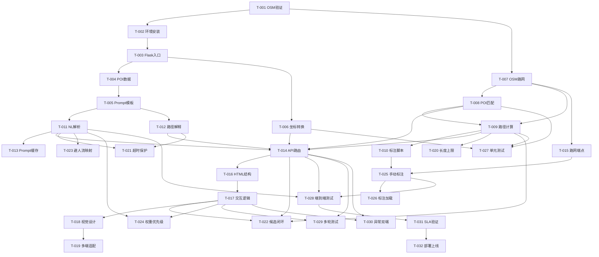

# 05 · 开发任务清单

> 产出阶段: Stage 5 · 任务拆解
> 角色: Engineering Manager（研发经理）
> 状态: 待执行
> 输入: `01_PRD.md`、`03_TDD.md`、`04_ARCH_REVIEW.md`、`06_DECISIONS.md`
> 约束: 禁止写代码、改变架构、增加需求

---

## 任务总览

共 9 个阶段，32 个任务。按依赖关系排序，每个任务单一目标、可独立交付。

| 阶段 | 名称 | 任务数 | 优先级 |
|------|------|--------|--------|
| P0 | 前置验证 | 2 | 最高 |
| P1 | 项目基础 | 3 | 高 |
| P2 | GIS 核心层 | 5 | 高 |
| P3 | LLM Agent 层 | 3 | 高 |
| P4 | API 层 | 2 | 高 |
| P5 | 前端实现 | 4 | 中 |
| P6 | 架构审核 Notes 修复 | 5 | 中 |
| P7 | 数据标注 | 2 | 中 |
| P8 | 测试验证 | 5 | 中 |
| P9 | 部署上线 | 1 | 中 |

---

## Phase 0 · 前置验证（P0 · 必须最先执行）

### T-001: OSM 路网覆盖率验证脚本

- **目标**: 量化验证武大核心区 OSM 路网数据覆盖情况（架构审核 N1）
- **描述**: 编写独立脚本，从 OSM 下载武大 BBOX 范围内路网，输出路段总数、POI 连通性、关键路径可达性、路段长度分布，生成覆盖率报告
- **依赖**: 无
- **影响文件**: `scripts/validate_osm_network.py`
- **输入**: 武大 BBOX 坐标（`config.WHU_BBOX_*`）
- **输出**: `output/osm_validation_report.json`（含 coverage_rate、connectivity、critical_paths）
- **验收标准**:
  1. 输出武大核心区 footway/path 路段总数
  2. 15 条 query 涉及的 POI 全部连通
  3. 3 条关键路径（牌坊→樱顶、樱顶→老图书馆、教五→图书馆）存在通路
  4. 覆盖率 ≥ 80% 方可进入后续阶段；< 80% 触发降级方案

### T-002: 环境依赖安装与验证

- **目标**: 确保开发环境可从 git clone 跑到 python 入口（PRD §11.2 DX 要求）
- **描述**: 创建虚拟环境、安装 requirements.txt 依赖、验证 Flask/OSMnx/NetworkX/DeepSeek SDK 均可正常导入
- **依赖**: T-001（路网验证通过后执行）
- **影响文件**: `requirements.txt`, `.env.example`
- **输入**: `requirements.txt`
- **输出**: 可运行的 Python 虚拟环境，所有依赖 import 成功
- **验收标准**:
  1. `python -m venv venv` 创建虚拟环境成功
  2. `pip install -r requirements.txt` 全部安装成功
  3. `python -c "import flask, osmnx, networkx, pydantic, openai"` 无报错
  4. 整体耗时 ≤ 5 分钟

---

## Phase 1 · 项目基础（P1）

### T-003: Flask 入口与全局配置

- **目标**: 创建 Flask 应用入口，集中管理全局配置
- **描述**: 创建 `app.py`（Flask 入口、CORS、静态文件服务、dev/prod 切换）和 `config.py`（LLM/地图/权重/路网/POI 配置，所有参数集中）
- **依赖**: T-002
- **影响文件**: `app.py`, `config.py`
- **输入**: 无
- **输出**: 可启动的 Flask 空壳应用，`flask run` 可访问
- **验收标准**:
  1. `python app.py` 启动成功
  2. 访问 `http://localhost:5000` 返回 404（空壳）
  3. CORS 配置允许 localhost Origin
  4. `config.py` 中 DEFAULT_WEIGHTS、WEIGHT_BOUNDS、WHU_BBOX 等所有常量齐全

### T-004: POI 数据迁移与扩展

- **目标**: 将 POI 数据从 config.py 硬编码迁移到 data/pois.json，并扩展到 ≥ 15 个 POI
- **描述**: 创建 `data/pois.json`，包含附录 A 15 条 query 涉及的所有地名，每个 POI 含 id、name、aliases、coordinates、type、description 必填字段
- **依赖**: T-003
- **影响文件**: `data/pois.json`, `config.py`（移除硬编码 POI）
- **输入**: PRD 附录 A 15 条 query + TDD §4.1 数据结构
- **输出**: 独立 POI JSON 文件，≥ 15 个 POI
- **验收标准**:
  1. 15 条 query 涉及的所有地名（牌坊、樱顶、图书馆、教五、梅园、桂园、工学部、信息学部、行政楼、体育馆、珞珈山、樱花大道、老斋舍、鸦鸦山、食堂）全部覆盖
  2. 每个 POI 有唯一 id、标准名、至少 1 个别名、GCJ-02 坐标、类型、描述
  3. JSON 格式合法，可通过 `json.load()` 加载

### T-005: Prompt 模板与 Few-shot 示例

- **目标**: 创建 LLM 解析和解释的 System Prompt 模板
- **描述**: 创建 `agents/prompts/parse_system.txt`（空间偏好解析 Prompt + Few-shot）和 `agents/prompts/explain_system.txt`（路径解释 Prompt + Few-shot）
- **依赖**: T-004（POI 数据就绪）
- **影响文件**: `agents/prompts/parse_system.txt`, `agents/prompts/explain_system.txt`
- **输入**: TDD §8.1 / §8.2 Prompt 设计
- **输出**: 两个文本文件，含 System Prompt + 完整 Few-shot 示例
- **验收标准**:
  1. parse_system.txt 包含任务类型说明、约束等级说明、权重生成规则、POI 列表占位、输出 JSON 格式、≥ 5 个 Few-shot 示例
  2. explain_system.txt 包含解释生成规则、必含要素、≤ 150 字限制、≥ 2 个 Few-shot 示例
  3. Prompt 可通过 Python 文件读取拼接

---

## Phase 2 · GIS 核心层（P2）

### T-006: 坐标系转换模块

- **目标**: 实现 GCJ-02 ⇄ WGS-84 双向坐标转换（DEC-007）
- **描述**: 创建 `spatial/coord_transform.py`，实现 `gcj02_to_wgs84()` 和 `wgs84_to_gcj02()` 两个公共函数，使用标准迭代反算算法
- **依赖**: T-003
- **影响文件**: `spatial/coord_transform.py`
- **输入**: 无
- **输出**: 可调用的坐标转换函数
- **验收标准**:
  1. 两个方向转换函数均可调用
  2. 往返转换精度 ≤ 0.0001 度（即 ≤ 11 米）
  3. 边界值（中国境外坐标）有安全兜底
  4. 单元测试覆盖：标准坐标往返、边界坐标、异常输入

### T-007: OSMnx 路网加载与缓存

- **目标**: 实现武大校园 OSM 路网的下载、缓存、加载、失效逻辑
- **描述**: 创建 `spatial/network.py`，封装 `load_or_download_network()` 函数，首次调用时从 OSM 下载武大 BBOX 范围内 footway/path 路网并保存为 GraphML，后续调用直接加载 GraphML
- **依赖**: T-001（验证通过后）、T-003
- **影响文件**: `spatial/network.py`, `data/whu_road_network.graphml`（运行时生成）
- **输入**: `config.WHU_BBOX_*` 坐标
- **输出**: NetworkX Graph 对象（含 length、highway 等 edge 属性）
- **验收标准**:
  1. 首次下载生成 `data/whu_road_network.graphml`
  2. 二次加载耗时 < 1 秒
  3. 删除 GraphML 后自动重新下载
  4. 路网包含至少 80 条 edge

### T-008: POI 模糊匹配与消歧

- **目标**: 实现 POI 名称到坐标的精确/模糊匹配，支持别名和消歧
- **描述**: 创建 `spatial/poi.py`，封装 POI 加载、精确匹配、别名匹配、模糊匹配（编辑距离）、消歧（返回候选列表）、按坐标查找最近 POI
- **依赖**: T-004、T-007
- **影响文件**: `spatial/poi.py`
- **输入**: `data/pois.json`, 路网坐标
- **输出**: POI 查询函数（`find_poi_by_name`、`find_poi_near_coord`、`list_all_pois`）
- **验收标准**:
  1. 精确匹配 ≥ 15 个 POI 全部命中
  2. 别名匹配："樱花顶" → 樱顶、"老图" → 老图书馆 等
  3. 模糊匹配："鸦鸦山"（错别字）返回候选列表
  4. 消歧："图书馆"歧义时返回候选
  5. 按坐标查找最近 POI 精度 ≤ 10 米

### T-009: 多因素路径计算（硬约束 + 软成本）

- **目标**: 实现约束与权重分离的两步路径规划核心算法（DEC-011）
- **描述**: 创建 `spatial/routing.py`，实现：权重校验与归一化、硬约束过滤（slope=avoid 时过滤 slope_level=5、slope_level=4 加惩罚、兜底放宽）、软成本 Dijkstra 优化、路径长度上限（≤ 最短 ×3 或 ≤ 2000m）、降级模式处理、重叠率计算
- **依赖**: T-007、T-008
- **影响文件**: `spatial/routing.py`
- **输入**: NetworkX Graph、起终点、constraints、weights、road_annotations
- **输出**: `compute_route()` 返回推荐路线 + 最短路径 + 成本分解 + filter_status + overlap_rate + max_len
- **验收标准**:
  1. 三因素成本函数正确实现：Cost = w_d×D + w_s×S + w_v×(1−V)
  2. 权重校验：每个权重 ∈ [0.05, 0.8]，归一化总和=1
  3. 硬约束过滤：slope_level=5 被过滤、slope_level=4 加 2× 距离惩罚
  4. 兜底放宽：无可行路径时自动放宽到 slope_level=4 可通行
  5. 路径长度上限：≤ 最短 ×3 或 ≤ 2000m（取小）
  6. 降级模式：无标注路段降级为仅距离成本
  7. 重叠率计算正确

### T-010: 路段标注导出与转换脚本

- **目标**: 创建标注流程的辅助工具脚本
- **描述**: 创建 `scripts/export_edges_for_annotation.py`（导出路网路段清单为 CSV + Folium 可视化地图 HTML）和 `scripts/csv_to_json.py`（将标注完成的 CSV 转为 data/road_annotations.json）
- **依赖**: T-007、T-009
- **影响文件**: `scripts/export_edges_for_annotation.py`, `scripts/csv_to_json.py`, `data/edges_to_annotate.csv`（运行时生成）
- **输入**: 路网 Graph、路段数据
- **输出**: CSV 标注文件、可视化地图 HTML、最终 road_annotations.json
- **验收标准**:
  1. 导出 CSV 包含 edge_id、u、v、name、length_m、slope_level、scenery_level、note 列
  2. Folium HTML 在浏览器中可打开，每条路段显示位置和编号
  3. CSV → JSON 转换格式正确，可被 routing.py 加载
  4. 欧氏距离计算公式正确（(Δx² + Δy²)^0.5 × 111000）

---

## Phase 3 · LLM Agent 层（P3）

### T-011: NL 解析 Agent

- **目标**: 实现自然语言到结构化任务意图的 LLM 解析（F-001）
- **描述**: 创建 `agents/parser.py`，封装 `parse_query()` 函数，实现：加载 System Prompt + POI 列表、调用 LLM、Pydantic 校验 JSON 输出、2 次重试、超时保护、异常兜底（降级为快捷模式 + 默认权重）、快捷按钮模式直接映射权重
- **依赖**: T-005、T-008
- **影响文件**: `agents/parser.py`
- **输入**: NL 文本、POI 列表、约束/权重映射配置
- **输出**: `TaskIntent` 对象（含 task_type、start、end、constraints、weights、input_method、ambiguity）
- **验收标准**:
  1. Pydantic Model 定义：PoiRef、Constraints、TaskIntent 三个 BaseModel
  2. 超时保护：connect=5s、read=10s
  3. P99 JSON 格式错误率 < 1%（PRD §11.3）
  4. 异常兜底：降级为默认权重 + 错误提示
  5. 快捷按钮模式：直接返回 mode→weights 映射，不走 LLM
  6. 优先级：显式 NL > 快捷按钮 > 默认权重（架构审核 N6）
  7. POI 查询识别：用户问「X 在哪」「X 介绍」「X 是什么」等纯查询问题时，正确输出 `task_type = "poi_query"`、`start = {"name": X, "type": "poi"}`、`end = null`，不强行配对起终点
  8. 帮助/引导类识别：用户问「你能做什么」「怎么用」「推荐景点」「有哪些景点」时，输出 `task_type = "help"`、`ambiguity = null` 或 `constraints` 默认值（用于路由层返回功能说明 / POI 分类推荐列表）
  9. 多轮上下文承接：若携带 context（含上一轮的 start/end），用户本轮只说「换风景好的」「改成避开陡坡」等约束/偏好变更时，应复用 context 中的 start/end，只更新 constraints/weights，不要求用户重说起终点
  10. 不相关/闲聊兜底：用户问与武大空间导航无关的问题（天气、吃饭、闲聊）时，输出 `task_type = "unknown"` 或 `constraints` 默认值 + `ambiguity = "抱歉，我只能回答武大校园内的路径规划和景点信息查询问题哦。可以告诉我你想从哪走到哪，或者问「樱顶在哪」查询景点介绍~"`
  11. ambiguity 补全语义：若上一轮返回 ambiguity 提示（如「请指定起点」），本轮用户只回复单个 POI 名（如「牌坊」），应识别为补全缺失字段而非新 query，合并 context 后输出完整 TaskIntent
  12. Pydantic 枚举扩展：TaskIntent.task_type 的 Literal 取值从 {"path_planning", "poi_query"} 扩展为 `Literal["path_planning", "poi_query", "help", "unknown"]`，与上述 4 种对话类型一一对应；help / unknown 类型的 constraints 字段允许使用默认值，start/end 可以为 null

### T-012: 路径解释 Agent

- **目标**: 实现路径结果到自然语言解释的 LLM 生成（F-005）
- **描述**: 创建 `agents/explainer.py`，封装 `generate_explanation()` 函数，实现：加载 System Prompt、调用 LLM 生成 ≤ 150 字解释、模板兜底（LLM 调用失败时返回固定模板）
- **依赖**: T-005
- **影响文件**: `agents/explainer.py`
- **输入**: route 数据（constraints、weights、recommended_route、shortest_route、costs、filter_status、POI 列表）
- **输出**: 解释文本（≤ 150 字）
- **验收标准**:
  1. 解释必含：用户约束回应、途经景点、与最短路径差异
  2. 字数 ≤ 150
  3. LLM 失败时返回模板兜底
  4. 超时保护：同 parser.py 配置
  5. **POI 景点介绍润色功能**：除路径解释外，新增 `generate_poi_description(poi_name, raw_description, aliases=None) -> str` 公共函数；调用 LLM 将 pois.json 中的 description 原文润色成 ≤200 字人性化景点介绍（口语化、突出亮点、适合用户阅读），若 LLM 失败则直接返回 raw_description（不截断）；润色结果同时用于 API poi_detail.llm_description 和前端 InfoWindow 展示

### T-013: Prompt 缓存优化

- **目标**: 优化 LLM Prompt 加载性能，避免每次调用重复读文件
- **描述**: 在 `parser.py` 和 `explainer.py` 中添加模块级缓存，首次加载 System Prompt 后复用
- **依赖**: T-011、T-012
- **影响文件**: `agents/parser.py`, `agents/explainer.py`
- **输入**: 无
- **输出**: 缓存机制
- **验收标准**:
  1. 重复调用 `parse_query()` 不重复读取文件
  2. 首次加载后缓存命中

---

## Phase 4 · API 层（P4）

### T-014: RESTful API 路由层

- **目标**: 实现 5 个 RESTful API 端点（DEC-009）
- **描述**: 创建 `api/routes.py`，实现：POST /api/parse、POST /api/route、POST /api/chat、GET /api/pois、GET /api/pois/{name}，每个端点含参数校验、坐标系转换（GCJ-02 → WGS-84）、错误处理、异常兜底
- **依赖**: T-006、T-008、T-009、T-011、T-012
- **影响文件**: `api/routes.py`, `app.py`（注册路由）
- **输入**: 各端点请求参数
- **输出**: 6 个（实际 5 个 + 1 个路网初始化）可调用的 REST 端点
- **验收标准**:
  1. `/api/parse`：支持 NL 和快捷按钮两种输入，返回 TaskIntent
  2. `/api/route`：接收 TaskIntent，返回推荐路线 + 最短路径 + 成本 + POI + 解释 + candidates（场景 3）
  3. `/api/chat`：一站式接口，NL → 全流程
  4. `/api/pois`：返回 POI 列表
  5. `/api/pois/{name}`：返回单 POI 详情
  6. 所有端点支持 GCJ-02 ⇄ WGS-84 坐标转换（DEC-007）
  7. 错误码规范：400（参数错误）、404（资源不存在）、500（服务异常）
  8. **task_type = "poi_query" 分支**：`/api/chat` / `/api/route` 接收 poi_query 后，不进入 GIS 路径计算，直接调用 T-008 POI 查询取到详情 → 调用 Explainer LLM 将 description 润色成 ≤200 字人话介绍 → 返回结构：`{status: "poi_detail", poi: {name, aliases, coordinates, type, llm_description, raw_description}}`
  9. **task_type = "help" 分支**：`/api/chat` 接收 help 后，返回：`{status: "help", features: ["武大校园A→B路径规划（支持避开陡坡/风景/最短）","24个武大景点查询与介绍","按类型浏览景点（教学楼/门/景点/宿舍/食堂/图书馆）"], recommended_pois: ["牌坊","樱花大道","樱顶","老图书馆","珞珈山"], example_queries: ["从牌坊到樱顶，避开陡坡","樱顶在哪","推荐景点"]}`
  10. **task_type = "unknown" 分支**：`/api/chat` 接收 unknown 或 parser 返回 ambiguity 不相关引导后，返回：`{status: "unknown", message: parser.ambiguity, example_queries: ["从牌坊到樱顶","樱顶在哪","推荐景点"]}`
  11. **ambiguity 补全 + context 合并**：若上一轮 TaskIntent 返回 ambiguity 且前端透传 context（含缺字段的 TaskIntent 快照），本轮用户补全字段（如补了单个 POI 名）后，路由层需将 context 中的旧字段与本轮新解析的字段合并，生成完整 TaskIntent 后再进后续流程，不要求用户重填未缺失字段

### T-015: 路网初始化端点

- **目标**: 实现路网的首次初始化和状态查询
- **描述**: 在 `api/routes.py` 中增加 `POST /api/network/init` 和 `GET /api/network/status`
- **依赖**: T-007
- **影响文件**: `api/routes.py`
- **输入**: 无
- **输出**: 路网初始化状态
- **验收标准**:
  1. 首次调用自动从 OSM 下载路网并缓存
  2. 返回 cached 字段（true/false）表示是否使用缓存
  3. 状态端点返回路网 edge 数、POI 连通性等信息

---

## Phase 5 · 前端实现（P5）

### T-016: 前端 HTML 结构与高德地图集成

- **目标**: 创建前端主页 HTML，集成高德 JS API，布局符合 PRD §10.1 规范
- **描述**: 创建 `static/index.html`，包含：输入区（NL 输入框 + 3 个快捷按钮 + 提交按钮）、地图区（高德 JS API 2.0 加载）、结果区（路线摘要卡片 + POI 列表 + 解释文本，可折叠）、PWA manifest 引用
- **依赖**: T-014
- **影响文件**: `static/index.html`, `static/manifest.json`
- **输入**: 无
- **输出**: 可访问的前端页面结构
- **验收标准**:
  1. 布局：顶部输入区 + 主区域地图 + 底部结果区
  2. 异步加载高德 JS API（key 从 config.js 读取）
  3. 页面结构语义化（header/main/section/footer）
  4. PWA manifest 正确引用
  5. **POI 列表侧边栏结构**：左侧/右侧有可折叠的 POI 列表容器，顶部含分类筛选标签栏（全部 / 景点 / 教学楼 / 门 / 宿舍 / 食堂 / 图书馆），标签栏下方为 POI 卡片网格/列表区域
  6. **POI InfoWindow 模板结构**：预置 POI 信息弹窗模板，包含：名称标题（别名副标题）、LLM 润色介绍区、两个快捷操作按钮「从这里出发」「到这里去」
  7. **帮助/推荐结果展示区结构**：结果区包含帮助/推荐结果子结构——功能说明列表 + 推荐景点卡片网格 + 示例 Query 快捷 Chip 按钮（点击自动填入输入框并提交）

  8. **冷启动欢迎覆盖层**：
     8.1 `<body>` 末尾存在 `id="welcome-overlay"` 的全页面级覆盖层，包含遮罩（`.welcome-mask`）+ 卡片本体（`.welcome-card`）
     8.2 卡片内按顺序包含 4 部分：标题区（`.welcome-header`）、5 个 shortcut-card（`.welcome-shortcuts` 下 5 个 `.shortcut-card`）、3 步新手提示（`.welcome-tips`）、底部操作区（`.welcome-footer`：开始使用按钮 + 不再显示复选框）
     8.3 5 个 shortcut-card 均具备完整 `data-*` 参数：
         - 3 张 path_planning 类：`data-action="path_planning"` + `data-start` + `data-end` + `data-constraints` + `data-display-text`
         - 1 张 poi_query 类：`data-action="poi_query"` + `data-name` + `data-display-text`
         - 1 张 recommend_poi 类：`data-action="recommend_poi"` + `data-display-text`
     8.4 卡片最顶部存在 class="welcome-card-topbar" 的樱顶窗棂纹装饰条
     8.5 覆盖层的对话框满足基础无障碍：`.welcome-card` 有 `role="dialog"` + `aria-modal="true"` + `aria-label`；2 个关闭按钮（X / 开始使用）有 `aria-label`；遮罩和对话框有 `data-close-welcome="true"` 统一选择器
     8.6 header 的 `.header-content` 最右侧存在 `id="help-btn"` + `aria-label="帮助/欢迎引导"` 的圆形？按钮

### T-017: 前端交互逻辑

- **目标**: 实现前端 JavaScript 交互逻辑，对接后端 API
- **描述**: 创建 `static/js/app.js`，实现：NL 输入提交（调用 /api/chat）、快捷按钮点击（高亮态 + 调用 /api/parse shortcut 模式）、地图选点（点击地图获取 GCJ-02 坐标 + 反向地理编码）、路线渲染（推荐路线樱花粉实线 + 最短路径暖灰虚线 + POI 标记）、结果展示（路线摘要卡片 + POI 列表 + 解释文本）、4 类 Loading 状态、5 类 Error 状态、多轮对话上下文管理（localStorage）、场景 3 候选 POI 选择与自动重新规划
- **依赖**: T-016
- **影响文件**: `static/js/app.js`
- **输入**: 后端 API 端点
- **输出**: 功能完整的前端交互
- **验收标准**:
  1. NL 输入 → 调用 /api/chat → 渲染路线
  2. 快捷按钮 → 调用 /api/parse → 自动调用 /api/route
  3. 地图选点 → 获取坐标 → 识别 POI
  4. 路线渲染：推荐/最短路径颜色区分、可点击
  5. 4 类 Loading 和 5 类 Error 状态均有实现
  6. 多轮对话：保留最近 3 轮上下文
  7. 场景 3：候选 POI 卡片展示 + 点击后自动重新规划
  8. **POI Marker 默认展示**：地图加载后默认渲染 24 个 POI Marker，按 type 字段使用不同颜色/图标区分（景点=樱花粉 / 教学楼=翡翠绿 / 门=墨灰 / 宿舍=暖橙 / 食堂=暖黄 / 图书馆=藏青）
  9. **Marker 点击弹 InfoWindow**：点击任意 POI Marker 弹出 InfoWindow，展示：名称标题、别名副标题、`llm_description`（LLM 润色介绍，若失败则 fallback 到 raw_description）、底部两个快捷操作按钮「从这里出发」「到这里去」
  10. **InfoWindow 快捷按钮触发规划**：点击「从这里出发」→ 将该 POI 填入输入区 start 槽位并高亮；点击「到这里去」→ 填入 end 槽位并高亮；若 start + end 两边均已填充（另一槽来自之前选择或用户输入）→ 自动调用 `/api/route` 完成规划，无需用户再点「提交」
  11. **POI 列表交互**：POI 列表侧边栏加载 24 个 POI 卡片，点击分类筛选标签 → 同时过滤列表卡片和地图 Marker（仅显示对应 type）；点击任意列表卡片 → 地图 `panTo` 到 POI.coordinates 并自动弹出与点击 Marker 一致的 InfoWindow
  12. **三种响应状态的独立 UI 渲染**：
      - `status = "poi_detail"` → 自动 panTo + 弹 InfoWindow + 在结果区显示完整 POI 详情卡片
      - `status = "help"` → 结果区渲染功能说明列表 + 推荐景点卡片网格 + 示例 Query Chip；同时自动展开 POI 列表侧边栏并切换到「全部」标签
      - `status = "unknown"` → 结果区显示引导消息 + 3 个示例 Query Chip（点击自动填入并提交）
  13. **ambiguity 引导 UI**：后端返回 `ambiguity != null` 时，在输入框下方显示引导气泡 + 若 ambiguity 文本含候选（如 POI 候选）则同时渲染可点击 Chip，用户点击 Chip 后无需手打字直接作为下一轮补全提交，并自动带上上一轮 context 实现字段合并

  14. **冷启动欢迎卡片交互**：
     14.1 首次访问（localStorage 无任何 welcome 相关键）→ DOMContentLoaded 后 150ms 内自动弹出欢迎卡片
     14.2 正常关闭卡片后刷新 → 不自动弹出（验证 `localStorage.getItem('whu_welcome_seen') === 'true'`）
     14.3 勾选「以后不再显示此欢迎页」复选框后关闭 → `localStorage.getItem('whu_welcome_dont_show_forever') === 'true'` 生效，后续刷新永不自动弹（不考虑清 localStorage 的情况）
     14.4 5 种关闭方式全部有效：点右上角 X / 点遮罩层空白区 / 按键盘 Esc 键 / 点底部「✨ 开始使用」/ 点任意 5 个 shortcut-card
     14.5 点任意 shortcut-card 后：① 输入框 `value` 自动填入 `data-display-text` 的文本；② 自动调用现有 `submitNaturalLanguageQuery()`（不是独立 fetch）；③ 欢迎卡片关闭；④ 滚动到结果区
     14.6 点击 3 张 `data-action="path_planning"` 卡片 → 正确走路径规划流程，start/end/constraints 与 data-* 参数一致
     14.7 点击 1 张 `data-action="poi_query"`（景点查询 · 樱顶）卡片 → 后端返回 `task_type=poi_query start={"name":"樱顶"} end=null`，结果区显示 POI 详情，地图 panTo + 弹 InfoWindow
     14.8 点击 1 张 `data-action="recommend_poi"`（推荐景点）卡片 → 展开 POI 列表侧边栏 + 切换到「全部/推荐」标签 + 侧边栏顶部 2s 淡黄色高亮；不发起任何网络请求
     14.9 点击 header 右上角 `#help-btn`（？按钮）→ **强制**显示欢迎卡片，无论 localStorage 状态如何，且不修改 / 写入任何 localStorage 标记
     14.10 隐私模式降级：localStorage `setItem` 抛错（模拟 QuotaExceededError）→ 用内存变量 `sessionWelcomeShown` 兜底，当前标签页内只弹一次；刷新页面再弹一次（UX 降级可接受）
     14.11 防抖：1.5s 内连续点击多张 shortcut-card → 只触发第 1 次查询，后面点击忽略
     14.12 无障碍：系统设置 `prefers-reduced-motion: reduce` → 欢迎卡秒开秒关，无入场 stagger、无 springy 回弹、无 mask fade（transition 全 0s）
     14.13 Esc 关卡不影响输入：欢迎卡弹开时用户已在输入框打了 10 个字 → 按 Esc 关卡 → 输入框内容原封不动保留

### T-018: 前端视觉设计与 PWA 配置

- **目标**: 完成前端视觉设计和 PWA 部署配置
- **描述**: 使用 `frontend-design` skill 重做 CSS 视觉（樱花珞珈主题：樱花粉主色 + 翡翠绿辅色 + 暖白底色 + 思源宋体标题 + Material Design 间距/阴影/圆角/动效），创建 `static/css/style.css` 和 `static/sw.js`（Service Worker：首屏 cache-first、API stale-while-revalidate、高德 API network-only）
- **依赖**: T-017
- **影响文件**: `static/css/style.css`, `static/sw.js`, `static/manifest.json`, `static/icons/`
- **输入**: 无
- **输出**: 视觉完整的 PWA 应用
- **验收标准**:
  1. 主色：樱花粉 #E8929C，辅色：翡翠绿 #4A7C6F
  2. 标题字体：Noto Serif SC（思源宋体）
  3. 响应式断点：480px / 768px / 1024px / 1440px（PRD §10.4）
  4. 触摸目标 ≥ 44×44px
  5. Service Worker 注册成功
  6. manifest.json 含 192/512 icon、theme_color、display: standalone

  7. **冷启动欢迎卡片样式**：
     7.1 桌面端（≥ 768px）：`.welcome-card` 固定尺寸 480×640px，屏幕水平垂直居中，border-radius = var(--radius-lg)；`.welcome-shortcuts` 为 3+2 grid（第一行 3 张第二行 2 张居中，推荐景点宽卡占满第二行全宽）
     7.2 移动端（< 768px）：`.welcome-card` 宽度 92vw（min-width 300px），最大高度 88vh；`.welcome-shortcuts` 改为单列 flex（5 张卡片纵向排列每张 72px 紧凑布局）；`.welcome-tips` 折叠成「新手提示 ▾」按钮点击才展开；「以后不再显示」复选框字号缩小为 0.8rem
     7.3 遮罩层 `.welcome-mask` 背景色为 `var(--paper)` 透明度 0.68，能隐约看到后面的地图（不遮挡信息），z-index ≥ 9999（压过高德地图的所有 UI 控件）
     7.4 5 张 shortcut-card 的 2px 左边框 accent bar 颜色正确：
         - 经典路线（sc-accent）→ `border-left: 2px solid var(--cherry-deep)`
         - 赏樱路线（sc-pink）→ `border-left: 2px solid var(--cherry)`
         - 景点查询（sc-jade）→ `border-left: 2px solid var(--jade)`
         - 最短路径（sc-stone）→ `border-left: 2px solid var(--ink-light)`
         - 推荐景点（sc-wide）→ `border-left: 2px solid var(--color-poi)`（暖橙）
     7.5 `.welcome-card-topbar`（签名元素 · 樱顶窗棂纹装饰条）高度 48px，使用 `linear-gradient` + `repeating-linear-gradient` 画出樱粉-翠玉渐变背景 + 竖线窗棂 + 横线屋檐三层叠加，无图片资源
     7.6 动画符合 spec：
         - 入场：遮罩 200ms 淡入，卡片 280ms cubic-bezier(0.2,0.8,0.2,1) springy 回弹，5 张 shortcut-card 使用 `:nth-child` + `animation-delay` 依次 stagger 入场（每张间隔 60ms，总 360ms）
         - 退场：遮罩 150ms 淡出，卡片 180ms ease-in 淡出下移
     7.7 字体完全复用现有栈：`.welcome-title` 使用 `font-family: "Noto Serif SC", "Songti SC", "STSong", serif`（与 `.app-title` 一致），正文所有文字使用现有 body 字体栈（PingFang SC / YaHei），不引入任何新字体引用

### T-019: 前端配置与多端适配

- **目标**: 创建前端配置文件，确保多浏览器兼容性
- **描述**: 创建 `static/js/config.js`（AMAP_KEY、API_BASE_URL、DEFAULT_CENTER 等配置常量），验证 5 个目标浏览器（iPhone Safari + Android Chrome + Chrome/Firefox/Edge 桌面端）
- **依赖**: T-018
- **影响文件**: `static/js/config.js`
- **输入**: `config.py` 中的 AMAP_KEY 和端口配置
- **输出**: 配置完成的前端
- **验收标准**:
  1. config.js 可被 app.js 正确引用
  2. 5 个浏览器均可正常使用地图、路线渲染、NL 输入
  3. PWA 可在移动端"添加到主屏幕"

---

## Phase 6 · 架构审核 Notes 修复（P6）

### T-020: 路径长度上限保护

- **目标**: 实现硬约束过滤后的路径长度上限（架构审核 N2）
- **描述**: 在 `spatial/routing.py` 的 `compute_route()` 中实现：推荐路线长度 ≤ 最短路径 ×3 或 ≤ 2000m（取小），超过时自动降级（放宽约束），降级标记写入 filter_status
- **依赖**: T-009
- **影响文件**: `spatial/routing.py`
- **输入**: 路径计算结果
- **输出**: 受限于长度上限的路线
- **验收标准**:
  1. 长度检查在 Dijkstra 计算完成后执行
  2. 超过上限时自动放宽 slope 约束
  3. 降级时 filter_status = "degraded_slope"
  4. 解释文本中标注"约束放宽"

### T-021: LLM 调用 timeout 保护

- **目标**: 为所有 LLM 调用添加超时保护（架构审核 N3）
- **描述**: 在 `agents/parser.py` 和 `agents/explainer.py` 的 LLM 调用中添加 timeout 参数（connect=5s, read=10s），捕获 APITimeout 异常，返回兜底结果
- **依赖**: T-011、T-012
- **影响文件**: `agents/parser.py`, `agents/explainer.py`
- **输入**: 无
- **输出**: 超时保护机制
- **验收标准**:
  1. LLM 调用添加 timeout 参数
  2. APITimeout 被捕获，返回兜底结果（默认权重 + 超时提示）
  3. 日志记录超时事件

### T-022: 场景 3 候选 POI 交互闭环

- **目标**: 实现场景 3（起点 + POI 类型）的候选 POI 返回与前端选择交互（架构审核 N4）
- **描述**: 后端 `/api/route` 增加 `candidates` 字段，前端以卡片列表展示候选，用户点击后自动重新规划
- **依赖**: T-009、T-014、T-017
- **影响文件**: `api/routes.py`, `static/js/app.js`
- **输入**: 场景 3 请求
- **输出**: 候选 POI 列表 + 自动重新规划
- **验收标准**:
  1. 后端返回 candidates（含 POI 名称、类型、路网距离、scenery_score）
  2. 前端卡片式展示候选
  3. 点击候选自动触发重新规划
  4. 无候选时返回错误提示

### T-023: "避人流"语义映射

- **目标**: 实现"避开人流"语义占位映射（架构审核 N5）
- **描述**: 在 parser.py 中将"避人流"映射为 distance=relaxed + scenery=any，在解释文本中标注"已选择相对清静的路线"
- **依赖**: T-011
- **影响文件**: `agents/parser.py`
- **输入**: 含"避人流"关键词的 NL 输入
- **输出**: 正确映射的 constraints
- **验收标准**:
  1. "避人流"、"避开人流"、"人少的路"等均触发映射
  2. constraints: {distance: "relaxed", scenery: "any"}
  3. 解释文本中包含"已选择相对清静的路线"

### T-024: 快捷按钮与权重优先级

- **目标**: 实现优先级规则：NL > 快捷按钮 > 默认权重（架构审核 N6）
- **描述**: 在 parser.py 和 routes.py 中实现：NL 输入含偏好 → LLM 生成权重；NL 无偏好 + 快捷按钮 → 按钮预设权重；NL 无偏好 + 无按钮 → DEFAULT_WEIGHTS。前端实现：LLM 生成权重后清除快捷按钮高亮
- **依赖**: T-011、T-017
- **影响文件**: `agents/parser.py`, `api/routes.py`, `static/js/app.js`
- **输入**: 混合输入场景
- **输出**: 正确的权重选择
- **验收标准**:
  1. 三种优先级场景均正确处理
  2. 解释文本中说明偏好来源（"已按您的景观偏好推荐" / "已按默认路线推荐"）
  3. 快捷按钮点击后高亮，NL 解析含权重后清除高亮

---

## Phase 7 · 数据标注（P7）

### T-025: 路段坡度/景观手动标注

- **目标**: 完成武大核心区 80-120 条路段的坡度和景观手动标注（DEC-003）
- **描述**: 运行 `export_edges_for_annotation.py` 导出路段清单 → 用 Excel 打开 CSV → 参考 Folium 地图 HTML → 逐条标注 slope_level（1-5）和 scenery_level（1-5）→ 运行 `csv_to_json.py` 生成 `data/road_annotations.json`
- **依赖**: T-010、T-015
- **影响文件**: `data/road_annotations.json`
- **输入**: CSV 路段清单
- **输出**: 标注完成的 JSON 文件
- **验收标准**:
  1. 覆盖率 ≥ 80%（武大核心区 footway/path）
  2. 附录 A 15 条 query 涉及路段全部覆盖
  3. 樱顶、老图书馆、珞珈山等核心 POI 周边路段全覆盖
  4. 标注时间预估 1-2 小时

### T-026: 标注数据加载与验证

- **目标**: 实现路段标注数据在路网加载时的 merge 逻辑
- **描述**: 在 `spatial/network.py` 中，加载路网后自动 merge `data/road_annotations.json` 中的 slope_level/scenery_level 到 edge 属性
- **依赖**: T-025
- **影响文件**: `spatial/network.py`
- **输入**: `data/road_annotations.json`
- **输出**: 带标注属性的路网
- **验收标准**:
  1. 标注覆盖率 ≥ 80% 时，routing.py 完整模式生效
  2. 覆盖率 < 80% 时，降级模式生效（仅距离成本）
  3. 降级时解释文本标注"部分路段缺标注数据"

---

## Phase 8 · 测试验证（P8）

### T-027: 核心模块单元测试

- **目标**: 为核心模块补充单元测试
- **描述**: 创建 `tests/` 目录，为 routing.py（resolve_weights 边界值 + compute_route 基本路径）、coord_transform.py（GCJ-02 ⇄ WGS-84 往返精度）、poi.py（模糊匹配 + 消歧 + 按坐标查找）编写 pytest 测试
- **依赖**: T-006、T-008、T-009
- **影响文件**: `tests/test_routing.py`, `tests/test_coord_transform.py`, `tests/test_poi.py`
- **输入**: 无
- **输出**: pytest 测试用例
- **验收标准**:
  1. 权重校验：[0.05, 0.8] 边界值测试通过
  2. 坐标转换：往返精度 ≤ 0.0001 度
  3. POI 精确/模糊/消歧匹配：15 个 POI + 3 个别名 + 1 个错别字全部通过
  4. `pytest tests/` 全部通过

### T-028: NL 解析与路径计算端到端测试（15 条标准 query）

- **目标**: 验证 15 条标准测试 query 的端到端正确性（PRD 附录 A）
- **描述**: 构造测试脚本，逐条发送 15 条 query 到 `/api/chat` 端点，验证：任务类型、constraints、weights、路径连通性、重叠率 ≤ 70%
- **依赖**: T-011、T-014、T-025
- **影响文件**: `tests/test_end_to_end.py`
- **输入**: 15 条标准 query
- **输出**: 测试报告
- **验收标准**:
  1. 任务类型正确识别 ≥ 80%（12/15）
  2. constraints 正确提取 ≥ 80%
  3. 路径连通性：15 条 query 均可生成路线
  4. 重叠率 ≤ 70%（基于标注数据）
  5. 热启动 P50 ≤ 15s

### T-029: 多轮对话测试（10 条测试集）

- **目标**: 验证多轮对话指代理解正确率（TDD §16.2）
- **描述**: 构造 10 条多轮对话测试集（TDD §16.2 定义），发送到 `/api/chat` 端点，验证指代理解和约束调整正确率
- **依赖**: T-014、T-017
- **影响文件**: `tests/test_multiturn.py`
- **输入**: 10 条多轮对话测试用例
- **输出**: 测试报告
- **验收标准**:
  1. 指代理解正确率 ≥ 80%（8/10）
  2. 约束调整正确 ≥ 80%
  3. 3 轮上下文保留正确
  4. **ambiguity 补全 + 4 种 task_type 全链路通过**：10 条多轮测试集中至少包含：① 缺起点→补起点→再换偏好（3 轮续接）；② 纯 POI 查询（task_type=poi_query）；③ 帮助引导（task_type=help）；④ 不相关问题（task_type=unknown），以上 4 类 case 端到端成功率 ≥ 90%，且每类响应 status 字段正确、UI 能正常渲染对应状态

### T-030: 异常场景与双端测试

- **目标**: 验证 8 种异常场景兜底（原 PRD 附录 E 6 种 + 新增 2 种对话完整性场景）和 5 浏览器双端兼容性
- **描述**: 手工测试 8 种异常场景（PRD 附录 E 原 6 种 + 新增「不相关问题/闲聊兜底友好提示」「帮助引导/POI 查询完整闭环」2 种）和 5 浏览器双端（PRD 附录 D）
- **依赖**: T-014、T-017
- **影响文件**: `project-docs/08_QA_REPORT.md`
- **输入**: 异常场景触发方式
- **输出**: QA 测试报告
- **验收标准**:
  1. 8 种异常场景均有友好兜底，不抛原始错误；其中新增的 2 种：
     - 「不相关问题/闲聊兜底」：返回引导文案 + 示例 Query Chip，用户点击可直接触发新查询
     - 「帮助引导/POI 查询完整闭环」：help 和 poi_query 响应 status 正确，前端 UI（侧边栏/InfoWindow/结果卡片）正常渲染，快捷跳转按钮可用
  2. 5 浏览器均可正常使用核心功能
  3. PWA 在移动端可添加到主屏幕

### T-031: SLA 性能验证

- **目标**: 验证热启动 P50 ≤ 15s 和冷启动 P50 ≤ 30s SLA
- **描述**: 使用 15 条标准 query 连续 3 轮测试热启动延迟；使用 Render 部署后测试冷启动延迟
- **依赖**: T-028
- **影响文件**: `project-docs/08_QA_REPORT.md`
- **输入**: 15 条 query
- **输出**: 性能测试报告
- **验收标准**:
  1. 热启动 P50 ≤ 15s
  2. 冷启动 P50 ≤ 30s
  3. 连续 15 条 query 无崩溃、无超时

---

## Phase 9 · 部署上线（P9）

### T-032: Render 部署与文档完善

- **目标**: 部署到 Render 并完善 README 文档（PRD §11.2 DX 要求）
- **描述**: 创建 Render 配置（render.yaml 或 Procfile）、完善 README（含 15 分钟 Hello World 流程、环境变量配置、部署步骤）、设置高德 Key Referer 白名单
- **依赖**: T-031
- **影响文件**: `render.yaml`（或 `Procfile`）、`README.md`
- **输入**: 生产环境配置
- **输出**: 公网可访问的线上服务 + 完整 README
- **验收标准**:
  1. `gunicorn app:app --workers 1 --timeout 60` 启动成功
  2. 公网 URL 可访问
  3. README 包含完整 15 分钟 Hello World 流程
  4. 高德 Key 设置 Referer 白名单限制 Render 域名

---

## 任务依赖关系图

---

## 阶段完成标准

本阶段（Stage 5）产出 `05_TASKS.md`，定义 9 个阶段共 32 个开发任务。每个任务包含明确的目标、依赖、影响文件、输入输出、验收标准。

**等待 Stage 5 审核确认后**，进入 Stage 6 · 开发实施。

---

> 本任务清单基于 `01_PRD.md`、`03_TDD.md`、`04_ARCH_REVIEW.md`、`06_DECISIONS.md` 编写。
> 所有任务均为单一目标，依赖关系清晰，可独立交付。
