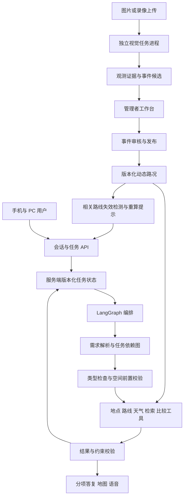

# 珞珈智行：Agent 框架深度调研与收敛方案

> **历史调研基线。** 本文保留 2026-09-29 的方案与当时代码状态；已实施范围和当前验收请以 [2026-10-01 项目进度与基础评测](18_项目进度与基础评测_20261001.md) 为准。

日期：2026-09-29。用途：导师讨论、工程实施排序、论文研究设计与最终验收。

本次是代码审查、文献调研和方案设计，没有修改业务代码、运行性能实验、训练视觉模型或部署新功能。文中的数值门槛为拟定验收目标，不是已有成绩。

原始代码事实基线为已发布提交 `5013574`；截至 2026-09-30，生产最新提交为 `7fe99e5`，当前审查目录为 `C:/Users/HUAWEI/.codex/worktrees/campus-data-reliability/campus-spatial-intelligence-agent`。桌面主目录当前为较早的 `970db39`，本报告放在桌面项目方便阅读；后续开发从包含 `7fe99e5` 的工作树继续，避免覆盖已完成的校方数据融合和多途经点修复。正文原始代码行号对应 `5013574` 审查基线；本节在线状态核验对应 `7fe99e5`。

## 1. 结论与建议定位

建议把珞珈智行定位为：**面向校园出行服务的情境感知空间智能体，研究多轮需求记忆、复合任务执行与动态空间事件共同变化时，系统如何持续给出可执行、可解释的服务。**

用户体验是主线：能承接上下文，能听懂一件事里的多个要求，能纠正与撤回需求，能解释选择，遇到缺数据或执行失败能明确反馈。路径规划、地点检索、游览安排、天气和动态管制共同支撑这条主线。

推荐技术路线：**保留 Flask、现有空间算法及 OSM＋校方数据＋高德混合架构；引入 LangGraph 作为执行编排层；以 Pydantic 类型契约、服务端版本化状态和 PostgreSQL 持久化为可靠性基础；建设独立管理工作台和可插拔机载视觉服务。**

论文的候选贡献应落在三个可以独立验证的机制上：

1. **带来源与作用域的空间任务记忆更新机制。** 将“这次不要楼梯”“以后更喜欢平坦”“改去另一个地方”分别写入正确作用域，保留实体指代和修改历史。
2. **受空间约束的复合任务编排与增量恢复机制。** 把自然语言目标转换成依赖图，检查地点、时间、通行和工具前提，修改需求后只重算受影响部分，并给每个子任务明确结果。
3. **观测—审核—事件—决策的动态服务闭环。** 图像识别或管理员输入形成带时间、位置与证据的事件，经确认后影响相关路线，并解释为什么更新。

这些是研究假设，不是已经证明的新颖性。使用 LangGraph、接入检测模型、增加管理页面本身都不足以构成方法创新；需要对照、消融和失败分析证明上述机制的效果。

“后续不再迭代”建议落实为：本轮冻结论文所需的能力范围、接口与验收标准；完成后冻结实验版本。漏洞、数据错误和外部服务变化仍需维护，不能承诺软件从此零修改。

## 2. 现有系统：保留哪些基础，缺口在哪里

当前主流程是 `/api/chat → run_agent → 工具调用 → 空间计算 → 单个响应包 → 地图/语音`，不是 LangChain 或多智能体群聊框架。

已经具备：10 个工具、结构化路线快照、无需 LLM 的按钮重算、距离/坡度/景观策略、画像学习、天气和路况、PC 规划/移动导航区分。普通通勤目前已走纯最短路径；不能依据旧 HANDOFF 中的 0.90/0.05/0.05 再改回去。

| 发现 | 代码依据 | 影响与确定性 |
|---|---|---|
| 最近 8 条消息入提示词，每条最多 500 字 | `agents/planner.py:165` | 已确认；长对话中的约束、候选关联和撤销历史缺少可靠载体 |
| 上轮路线注入提示词只明确投影 start/end | `agents/planner.py:176`，对照 `agents/route_state.py` | 已确认；完整 via/tour/legs 尚未成为对话推理的统一上下文，不能说按钮重算完全没做 |
| `avoid_slope` 从上轮继承后用 OR 累加 | `agents/planner.py:225,278` | 已确认分支；显式取消旧约束存在不能清除的风险，需用撤销场景复现 |
| 页面每次初始化新建 sessionId，再按它读取本地历史 | `static/js/app.js:389,394,3700` | 已确认；刷新后的 key 与原 key 不同，当前恢复设计不能正常接续原会话 |
| 路线 artifact 产生后结束循环 | `agents/planner.py:309` | 已确认；需要下一轮工具调用的其他目标可能未执行 |
| 只保存一个 `artifact_route`，同批多个路线会覆盖变量 | `agents/planner.py:215,286` 附近 | 已确认单结果结构；不适合多路线对比或多个独立任务 |
| 工具调用逐个执行，最多 6 轮 | `agents/planner.py:28,261` | 已确认；缺少任务依赖、逐项状态、重试和恢复模型 |
| 40 秒预算只在轮次开始检查，单次 read timeout 为 25 秒 | `agents/planner.py:29,53,231` | 已确认；40 秒不是严格截止时间，后续工具及旧解析器兜底会进一步消耗时间 |
| 前端 fetch 没有主动截止和取消 | `static/js/app.js:2800` | 已确认；网络挂起时难以及时结束等待 |
| 全局 requestSeq 丢弃旧响应，没有给旧任务收尾 | `static/js/app.js:2920,2966,3062` | 已确认；它能防旧结果覆盖新结果，但不能管理并发任务，旧“思考中”气泡可能遗留 |
| 闲聊、澄清、候选和部分失败会清空地图路线并停止导航 | `static/js/app.js:2227` 及其调用处 | 已确认；用户问附加问题时，当前路线展示可能被移除，产生上下文丢失的体验 |
| 用户画像用进程缓存＋JSON 文件，锁只覆盖本进程 | `agents/profile.py:29,47,57` | 已确认；多 worker 下存在旧缓存和覆盖写风险，尚未测量生产丢更新频率 |
| 路况也采用 JSON，加载与保存分开加锁，读取失败可返回空列表 | `spatial/road_conditions.py:81,102,135` | 已确认；多写入者及异常读取条件下风险增加，不适合再接自动感知事件 |
| 已有管理员鉴权和路况 CRUD，用户页面内混有管理逻辑 | `api/routes.py:561` 起；`static/js/app.js:1727` 起 | 已确认；独立管理入口可复用后台，不必重写已有能力 |
| 当前生产上传体积限制为 1 MB | `app.py:55` | 已确认；机载图片/视频需要独立上传流程与大小限制 |
| 当前实验调用旧 `parse_query`，多轮上下文由 gold 构造，路由实验也使用 gold 端点 | `experiments/runner.py:89,130,288` | 已确认；这些实验有组件评测价值，但不能当作当前 Agent 端到端成绩 |

以上来自静态代码审查，不冒称已复现所有线上故障。“多任务无响应”至少要分别验证：一句话含多个目标、用户连续快速提交、多个用户并发、长耗时视觉任务四种情况。

## 3. 论文与开源框架：可借鉴什么

### 3.1 与《测绘学报》的关系

中国测绘学会发布的专刊启事明确涉及地理空间智能体、混合智能计算、感知认知表达服务等方向；公告列出的截稿日期为 **2026-10-31**。这只是公开征稿时间，导师收到的定向约稿是否同一安排仍以导师与编辑部沟通为准。[专刊启事](https://csgpc.org/detail/27900.html)

已核对本地下载的六篇《测绘学报》PDF 的题名与摘要，并重点查看部分方法、讨论和实验章节。借鉴关系如下，不能把不同论文的任务和指标混为同一基线。

| 文献 | 本项目借鉴 | 不应直接照搬 |
|---|---|---|
| 吴华意等，2025，《大语言模型驱动的GIS分析：方法、应用与展望》，54(4):621–635，[DOI](https://doi.org/10.11947/j.AGCS.2025.20240468) | 从任务、数据、方法和评价体系组织研究；评估可解释性与可信度 | 综述中的通用框架不能自动证明本文方法创新 |
| 吴华意等，2024，《面向地学分析AI建模的地理信息服务层次网络模型》，53(11):2053–2063，[DOI](https://doi.org/10.11947/j.AGCS.2024.20240109) | 需求→抽象任务→功能→服务接口→函数实例的层次组织；用于工具目录及任务依赖 | 只有十余个工具时无需建设庞大知识图谱 |
| 李志林等，2024，《自主式情境化地图表达：大模型时代的智能化地图制图理论探讨》，53(11):2043–2052，[DOI](https://doi.org/10.11947/j.AGCS.2024.20240222) | 将用户、任务、环境与交互历史共同作为情境；PC 与手机采用不同表达 | 地图美化不等于情境感知方法已成立 |
| 冉耘博等，2026，《多维偏好增强型对抗深度强化学习驱动的行人路径规划》，55(2):191–205，[DOI](https://doi.org/10.11947/j.AGCS.2026.20250480) | 多维偏好、动态干扰、控制变量与消融实验 | 没有必要因该文使用强化学习就替换校园 Dijkstra；其任务不同，不能直接比论文表格数字 |
| 陈军等，2024，《智能化测绘的混合计算范式与方法研究》，53(6):985–998，[DOI](https://doi.org/10.11947/j.AGCS.2024.20240131) | 数据、领域知识、模型与人在回路协同；支撑事件审核和确定性空间校验 | 不把“混合智能”仅写成口号，要说明知识在哪一步约束结果 |
| 王立增等，2026，《局部-全局联合感知的时空自适应交通集成预测方法》，55(2):206–221，[DOI](https://doi.org/10.11947/j.AGCS.2026.20250340) | 时间变化、空间关联、跨场景评价 | 该文研究交通预测，不直接解决航拍图片拥堵识别 |

另外，MapColor-Agent 已在《测绘学报》发表，从作者主页可确认题名与发表信息。本轮官网全文链接不可用，不能据此声称核实了其内部实验细节；可作为后续相关工作补读。[作者原始发表列表](https://trentonwei.github.io/)

通用研究参考：

- [ReAct](https://arxiv.org/abs/2210.03629)：支持行动与观察交替；当前项目已有相近流程，单纯换名称没有新增贡献。
- [GIS Copilot](https://arxiv.org/abs/2411.03205)：按空间任务复杂度评价工具组合执行，适合作为校园简单、复合、动态任务分层的参考。
- [LongMemEval，ICLR 2025](https://arxiv.org/abs/2410.10813)：借鉴事实更新、时间推理、跨会话与不知道时不乱答的评价维度；不直接用其通用成绩代替校园记忆测评。
- [τ-bench](https://arxiv.org/abs/2406.12045)：用最终状态验证任务是否完成，并关注多次执行的一致性；项目应评估最终地点、约束、事件和完成任务集合，而非仅看回复是否流畅。

### 3.2 框架比较与选择

| 方案 | 经官方资料核对的能力 | 对本项目的判断 |
|---|---|---|
| 保留自写循环并扩建状态机 | 全部可自主控制 | 少一个依赖，但需自行实现持久化、恢复、任务图和中断，后续维护负担较大；作为迁移回退方案 |
| **LangGraph** | 显式图状态、持久化、中断恢复、流式执行，可混用确定性与 LLM 节点 | **推荐主方案**；只接编排层，已有工具和 Flask 保留 |
| Pydantic AI | 类型化输出、参数校验、工具与依赖注入，并有持久执行集成 | 合理备选；本项目可先直接使用已有 Pydantic，避免同时引入两套 Agent runtime |
| CrewAI Flows | 类型化状态、事件式流程、持久化 | 同样能做受控流程，不能说它只能角色群聊；但当前迁移更重，无明确必要 |
| AutoGen / Microsoft Agent Framework | AutoGen 官方已标注维护模式，并推荐新用户使用 Microsoft Agent Framework | 不以旧 AutoGen 作为新迁移基础；MAF 作为比较项，其跨运行时能力暂非当前重点 |

依据：[LangGraph 概览](https://docs.langchain.com/oss/python/langgraph/overview)、[持久化](https://docs.langchain.com/oss/python/langgraph/persistence)、[中断](https://docs.langchain.com/oss/python/langgraph/interrupts)、[Pydantic AI](https://ai.pydantic.dev/)、[CrewAI Flows](https://docs.crewai.com/en/concepts/flows)、[AutoGen 官方仓库](https://github.com/microsoft/autogen)、[Microsoft Agent Framework](https://github.com/microsoft/agent-framework)。

选择理由是现有需求匹配与迁移成本，不是声称实测了各框架速度排名。LangGraph 不要求购买托管服务，也不保证自动修复记忆或提供任务队列；这些仍需按下述协议实现。依赖安装版本在实施首日做兼容性验证后锁定，论文记录精确版本。

## 4. 最终架构

LLM 负责需求分解、引用解析、受控计划和基于证据的表达；空间计算负责路线、时长估计、可达性、约束和路段匹配；数据库负责身份、版本、原子提交与任务恢复；视觉进程负责图像计算。不是每个框都需要一个独立 LLM。

数据库采用 PostgreSQL，共用会话、画像、任务、事件和审计存储；道路主图仍由现有 NetworkX 运行。暂不强制迁移到 PostGIS，不引入第二套空间事实库。LangGraph 使用持久 checkpointer；业务状态以数据库的 accepted revision 为权威，checkpoint 是执行进度，不另设冲突的权威源。

Flask 接收请求后快速返回任务编号。独立 worker 领取持久任务，视觉使用独立队列及进程，不占导航请求线程。第一版前端每 1–2 秒读取任务增量状态；如后续启用 SSE，需要另行验证连接数与 WebView 兼容，不能让少量 Gunicorn 线程被长连接耗尽。

## 5. 上下文记忆：核心协议

### 5.1 四类信息独立管理

| 类型 | 保存内容 | 生命周期 |
|---|---|---|
| 当前任务状态 | 起終点、多个途经点、顺序、方式、时间预算、硬约束、软策略、待澄清项 | 当前任务结束或用户清除；切方式只改方式 |
| 对话事件 | 用户话语、任务修改、工具结果摘要、候选实体及指代绑定 | 默认保留 30 天，可清除；实验导出需另行同意 |
| 长期偏好 | 用户确认的偏好及可信学习信号 | 可查看、修改、关闭与删除；临时“今天膝盖不舒服”不自动成为永久画像 |
| 环境事实 | 路网版本、天气时间、管制有效期、视觉事件状态 | 按数据源/事件有效期，不作为永久用户记忆 |

服务器签发匿名会话凭证及 conversation_id，刷新恢复同一会话，新对话显式创建新 ID。ID 只作索引，不作为授权；其他设备/用户不能仅凭猜到 ID 读取会话。账号与跨设备同步可留到有真实需求再接，手机导航和 PC 规划都使用同一状态协议。

### 5.2 使用增量修改，不让模型重写全部状态

每次理解结果表示为 `TaskPatch`：目标 task_id、base_revision、操作集合、引用证据。允许的操作是设置、添加、移除、清除、替换、撤销；每个字段标记来源、作用域与更新时间。

例：“把终点改成卓尔体育馆，还是不走楼梯。”只改 end 并保留 avoid_steps；“现在可以走楼梯了”显式移除该约束；“再查一下天气”创建查询子任务，不更改路线；“新行程，从星湖园去图书馆”创建新的 task_id，旧行程的临时约束不会自动继承。

优先级：已发布通行规则和有效硬约束 → 本轮显式修改 → 当前任务已确认字段 → 可适用的长期软偏好 → 默认值。用户能取消自己提出的约束，不能通过一句“忽略封路”取消管理方的有效封闭。

候选点击必须携带 `candidate_set_id + poi_id + task_id + base_revision`。“第二个”绑定最近相关候选集；存在多个候选集且指代不清才澄清，不从一句助手文本猜名字。

并发修改采用 compare-and-swap：只有 base_revision 等于当前版本才能提交。冲突返回结构化 409 和当前摘要，不允许旧结果覆盖新状态。成功输出一并提交 route_state、任务结果和 UI revision；失败保留上一条成功路线。

总结文本只辅助检索，不能覆盖结构化事实。先做实体检索、时间过滤和任务关联；只有校务文档增多时才为知识检索引入向量检索。精确地点解析继续调用 POI 工具。

### 5.3 必须覆盖的记忆场景

1. 连续 20 轮，穿插闲聊与天气，途经点、方式和硬约束仍一致。
2. 规划→选择风景→改骑行→自然语言改终点，保留未被修改的要求。
3. 添加两个途经点→删除第一个→撤销删除，顺序恢复正确。
4. 明确撤销避坡/楼梯约束，旧限制不粘住。
5. 新任务与延续旧任务不串线；另一用户的状态不可见。
6. 刷新、断网恢复、worker 重启后能继续；模型超时不丢已确认信息。
7. 缺目的地的澄清与旧成功路线共存，澄清回答只更新对应任务。

## 6. 多任务：明确区分复合需求与并发执行

例：“从星湖园去图书馆，路上买水，避开楼梯，顺便说一下下午天气，30 分钟内到。”

任务图为：解析端点→找买水候选→计算可达与绕行→带途经点规划→检查时间预算；天气查询可独立进行。输出要同时包含路线、买水点、时间是否可满足和天气；无法满足 30 分钟时指出估计依据并提供删去停留点等选项，不能偷偷忽略预算。

任务至少有 `pending/running/needs_input/succeeded/partial/failed/cancelled/superseded` 状态；等待用户与等待计算不同。每个子任务保存 dependencies、输入、输出、耗时、错误和证据引用；一个任务已产出路线不能触发整个复合请求提前退出。

执行政策：

- 同一 task_id 的状态修改串行提交；独立只读子任务允许有限并行；一个会话默认最多 2 个并行只读子任务。
- 修改正在运行的路线时，旧 run 标记 superseded，并终止其提交资格；尽可能取消外部调用，无法取消也不允许晚到结果覆盖。
- 每个请求有 request_id、run_id、幂等键；浏览器重试不重复创建任务。每个气泡对应自己的 run，不能再共用一个“最后请求”来管理全部任务。
- 对 LLM 和工具设置剩余时间预算，显式配置 SDK 重试；单个网络 read timeout 不等于整轮 deadline。重试必须有上限，不能预算耗尽后再次完整进入旧 LLM 解析链路。
- 对空间已知任务保留确定性降级；无法理解的请求给可操作的澄清或失败原因。返回已有成功子结果并列明未完成项。
- 前端显示真实状态，如“已找到买水点，正在比较路线”；不显示虚构百分比，不展示模型内部思维链。
- 新任务不会删除已有路线；用户明确新建行程、清空或切换当前任务时才改变主地图展示。

持久队列第一版可以使用 PostgreSQL 的任务表、领取租约及超时回收，避免同时新增 Redis 和 Celery。执行语义按至少一次设计；对可能有副作用的工具做幂等与事务，不能声称队列天然 exactly-once。图像推理进程采用独立并发和内存上限。

## 7. 工具体系：补齐真实需求，不堆工具数量

现有 10 个工具保留并加统一契约：类型化参数、返回状态、空间范围、CRS、时效、来源、是否可重试、预计开销和副作用级别。原本没有统一参数校验的 executor 入口应统一校验。

| 新增或增强能力 | 用户场景 | 实现与约束 |
|---|---|---|
| 增强 `plan_via_route` 为多个 stop | “先买水，再取快递，最后去图书馆” | 有序 stop 列表，停留时长可选；先支持明确顺序，不隐式变成复杂全局优化 |
| `compare_routes` | “这条比最短路多走多少，为什么推荐” | 同一快照下比较距离、估计时长、坡度/景观与未知属性比例；解释来自真实数值 |
| `find_reachable_places` | “步行十分钟内能吃饭的地方” | 路网可达时间或距离，不能把直线半径当作步行范围 |
| `plan_itinerary` | “一小时逛两个地方再回宿舍” | 时间预算、停留、顺序和回到起点；开放时间未知则明确说明，不保证营业 |
| `get_place_details` | 地点用途、别名、设施、开放时间 | 优先结构化数据；附来源与更新时间，缺项返回 unknown |
| `get_route_events` | “科技门附近有没有封路，会不会影响我” | 只查询有效已发布事件，输出与路线边的交集和时效 |
| `inspect_memory/update_preference` | “你还记得我这次的要求吗”“取消偏好” | 受控读写，明确本次/长期；不是任意数据库写工具 |
| `get_task_status/cancel_task` | “前一个处理完了吗”“先停掉” | 指向自己的 task/run；前端操作也直接使用同一 API |
| 管理端 `analyze_media/propose_event/preview_event_impact` | 图像识别与管制评估 | 权限受限；模型产生候选，发布由明确管理操作完成 |

工具按场景分组动态提供给模型：日常出行、地点服务、动态事件、管理者视觉。普通用户不暴露管理写工具。MCP 可作为将来的对接协议，现在内部 Python 工具无需为协议统一而全部拆成远程服务。

工具返回文本、POI 描述、管理者上传资料和图片内文字均作为待解释数据，不作为可更改系统权限的指令。状态补丁、工具选择和事件发布始终经过代码校验；基准中加入外部文本诱导忽略封路、跨任务写入的用例。

“不要楼梯”应有独立 `avoid_steps` 硬约束；“无障碍”还涉及坡度、路面、宽度和入口条件。数据不够时输出“已避开已知台阶，其他无障碍条件未核实”，不能把“平坦优先”当作无障碍认证。未知坡度和景观不能补成假精确值。

通勤维持真正的距离最短 `(1,0,0)`；明确游览才使用推荐或画像。必须区分最短距离与最少时间：“尽快到、避拥堵”可显式选择时间目标，不应暗中修改最短按钮语义。硬封路影响所有目标；软拥堵主要影响时间估计和最快/推荐目标。

## 8. 管理者独立工作台

路径建议 `/admin`，与普通用户界面分离。复用已有路况吸附、鉴权和 API 服务能力，新增管理者身份、角色、审计与事件状态机。普通用户仅看生效事件及其出行影响。

工作台必须有四块：

1. 事件地图与列表：创建封闭、施工、积水、活动、拥堵、疑似事故；地图选择明确路段，显示方向、模式、开始/结束时间。
2. 发布前预览：显示受影响边和代表路线的变化；支持只封机动车、部分通行等明确参数，不能仅凭“事故”类型就断言行人一定能过。
3. 感知审核：上传图片/录像，查看检测框、统计、时间窗和地图关联，修改候选后批准或驳回。
4. 审计与恢复：谁创建、审核、发布、撤销、过期；展示历史版本和撤销结果。

事件流程：`draft → pending_review → published → expired/revoked`，驳回记录保留。到期按查询时刻判断失效，不能只依赖定时器。恢复路段也必须更新事件版本。

`event_type`、`severity`、`blocked_modes` 和 `cost_effect` 分开。旧 `CONDITION_EFFECTS` 只作为明确标注的迁移模板，不能把所有施工或积水概括成同一种可通行规则。事件确认与路线影响一并写事务；通知使用 outbox 防止数据库已发布但用户状态不同步。

已有共享密码/token 可作为过渡导入；正式工作台使用个人管理账号，至少管理员、操作员、只读三类权限。校验 CSRF、登录限流、会话过期、对象权限和生产 SECRET_KEY；这些属于新管理写入与媒体上传所需的验收，不能只隐藏页面入口。

## 9. 机载图片/视频功能：按用户确认纳入本轮

用户已明确：先实现功能，真实数据源稍后接入；调试和训练先用公开数据。因此本轮交付必须包含真实推理可运行的上传—识别—审核—事件链路，不能只有接口占位或假结果。

### 9.1 能力层次

- **图片**：行人、车辆等目标检测与计数，选定区域的可见占用情况，以及带证据的疑似异常提示。单帧数量多不能直接证明拥堵，单帧也无法可靠估计速度。
- **视频**：目标跟踪、相机运动补偿、区域内队列/停留/低速持续性，生成疑似拥堵或异常停车/碰撞线索。
- **事件化**：将观测时间窗、目标统计、空间区域、不确定性和证据片段封装成候选；管理员确认后进入动态路况。

事故模块第一版定位为“疑似事故/异常事件辅助审核”。公共航拍检测数据没有提供所有事故真值，不能据目标检测完成就声称事故识别高准确率。

### 9.2 建议模型和处理链

首个可复现检测基线采用 RT-DETRv2-S 官方 PyTorch 实现及匹配权重，接 ByteTrack 做跟踪。小目标场景可评估切片推理；是否启用由固定验证集上的召回、误报和耗时共同决定。再选 YOLOX 作为较轻的对照候选，最终依据实际部署设备选择，不能照搬论文 GPU FPS。

参考：[RT-DETR 官方实现](https://github.com/lyuwenyu/RT-DETR)、[ByteTrack 官方实现](https://github.com/FoundationVision/ByteTrack)、[YOLOX 官方实现](https://github.com/Megvii-BaseDetection/YOLOX)、[SAHI 论文](https://arxiv.org/abs/2202.06934)。代码、权重与训练数据的许可证分别记录，开源代码不代表任何数据都能重新发布。

流程：校验上传→创建媒体任务→解码/抽帧→图像质量筛选→检测→视频跟踪与运动补偿→区域统计/时序规则→生成证据→候选事件→管理者审核。可选多模态模型只辅助解释画面和候选分类，不让它凭空填精确人数、速度、道路坐标或事故置信度。

拥堵特征至少包括选定区域内人数/车辆数、可见占用比例、持续时间、有效轨迹数量、经标定的速度或无量纲运动指标。区分行人与车辆；正常停放、红灯等待、活动聚集和运动场人群必须作为负例。无标定时不输出人/平方米或 km/h。

### 9.3 图像如何落到路网上

无人机 GPS 是拍摄位置，不是画面中目标位置。第一版允许管理员在地图绑定观测道路或区域，记录“人工定位”；具备控制点/正射影像时使用地理变换；具备相机内外参、姿态、高度和地形时再做投影。倾斜视角、坡地和运动相机不能无条件使用单个平面单应矩阵。

定位有歧义时保留多个候选边和误差说明，请管理员选择。不能为了自动化把区域强吸附到隔墙的最近道路。未定位影像仍可展示识别结果，事件发布前必须确认作用路段。

公开数据在原测试空间评价；如把外地片段演示映射到武大，必须放独立演示租户并显示“模拟位置”，不进入真实校园路况。

### 9.4 公共数据与验证分工

| 数据 | 用途 | 局限 |
|---|---|---|
| [VisDrone 官方数据](https://github.com/VisDrone/VisDrone-Dataset) | 航拍行人/车辆检测、跟踪、小目标与遮挡 | 不是校园拥堵/事故标签库；ignore 区域按官方规则处理 |
| [UAVDT 作者数据页](https://sites.google.com/view/daweidu/projects/uavdt) | 移动相机下车辆检测与跟踪 | 不直接提供本项目完整事件定义及路网关联真值 |
| [inD](https://arxiv.org/abs/1911.07602)、[highD](https://levelxdata.com/highd-dataset/) | 轨迹统计与交通状态规则验证 | 高速公路/交叉口不等于校园；访问与使用遵守研究许可，不预设能立即下载全部原视频 |
| [CADP](https://arxiv.org/abs/1809.05782) | 事故时序判别的辅助外域验证 | CCTV 视角，不是机载；成绩不能当作航拍事故成绩 |

首期先用 VisDrone＋UAVDT，保持官方训练/验证划分；补充事件标注需由人标注时间窗与负例，两人复核争议。按视频/拍摄场景划分，不能相邻帧跨训练与测试泄漏。未获得合适航拍事故测试集时，交付候选审核功能和外域实验，明确不具备校园事故准确率结论。

### 9.5 部署形式

视觉作为独立依赖环境和服务进程，可在有 GPU 的实验机器、另一个服务器或 CPU 离线队列运行；当前腾讯云机器是否具备合适算力尚未核实。导航服务不加载检测权重、不承担训练。第一版支持 JPEG/PNG 和常用 MP4 上传、任务进度与结果回放；实时流输入采用同一 adapter 接口，真实 RTSP/机载推流接入留给数据源到位时配置。

上传限制按端点设置，避免为视频放开所有 API 的大小约束。核对格式、时长、像素量和解码预算，媒体不放可执行目录。默认不做人脸/身份识别；公开演示导出时遮挡可识别信息。

## 10. 用户体验的必要变化

1. 输入区和结果区支持“当前任务清单”：去哪、经过哪里、限制是什么、哪些子任务在等待。
2. 每个任务独立进度、取消与重试；无结果不能长时间只显示“思考中”。
3. 地点/天气查询以附加卡片呈现，保留当前路线及导航；用户可切回上一任务。
4. 解释“为什么推荐”“哪些要求没有满足”“比另一条多走多少”；事实缺失明确显示，避免泛化承诺。
5. 长期偏好可查看与关闭；当前任务约束可直接删除或修改。
6. PC 提供计划、对比、过程和文字路段说明；手机保持简洁导航与路况变更提醒，不重新尝试 PC 高精度定位。
7. 动态事件只通知真正影响当前路线的用户；无关事件不反复打断。手机行进中优先简短通知和安全的重算交互。
8. 前端、API、移动壳显示统一 build_id 与数据版本诊断信息（普通界面只在“关于”查看），发布验收必须包含手机 WebView，不能仅看网页服务健康。

## 11. 实施顺序与依赖

| 阶段 | 交付 | 依赖 | 通过后才进入下一阶段的门槛 |
|---|---|---|---|
| P0：基线与契约，约 1–2 工作日 | 固定缺陷场景、输入/输出协议、任务与事件模型、兼容性检查 | 最新发布代码 | 新旧状态映射清楚，关键场景有可回放输入 |
| P1：记忆与状态，约 3–4 日 | 服务端会话、版本化 TaskPatch、偏好存储、刷新恢复和撤销 | P0 | 指代、撤销、新旧任务隔离与并发提交验证通过 |
| P2：编排与多任务，约 3–4 日 | LangGraph、任务图、worker、分项结果、截止与恢复、前端任务 UI | P1 | 复合目标逐项完成或明确失败，没有静默挂起/覆盖 |
| P3：空间工具与解释，约 2–3 日 | 多途经点、可达检索、路线比较、预算行程、显式硬约束 | P2 | 需求—工具—产出契约闭合，现有纯最短/按钮语义不回归 |
| P4：动态事件与管理台，约 2–3 日 | `/admin`、事件审核/发布/过期、影响预览与审计 | P1 事件模型；与 P3 可部分并行 | 发布、失效、撤销准确影响对应模式与边 |
| P5：机载感知，约 4–6 日 | 图片/视频推理、统计、定位绑定、候选审核和公开数据结果 | P0 可先准备数据；联调依赖 P4 | 真推理全流程可用、未知位置不误发布、视觉不阻塞聊天 |
| P6：验收与冻结，约 3–4 日 | 完整回归、故障与负载验证、论文基线/消融、手机上线验收 | P1–P5 | 下述阻断项全部通过，再冻结正式实验版本 |

总工作量约 18–26 个工作日，是估算而非保证；训练资源、真实用户实验和复现失败可能增加时间。若 10 月 31 日确为投稿截止，建议 10 月中旬冻结核心方法，之后预留正式实验与写作；这是紧排期，不能把 10 月 31 日前一晚当作功能开发结束日。

科研数据集定义、指标和基线从 P0 开始准备；开发期间用开发集验收，冻结之后再运行保留测试集。视觉纳入本轮功能交付，但航拍事故泛化效果在证据不足时不作论文核心定量主张。

## 12. 验收标准

以下为建议初版合同，实施首日结合服务器和模型延迟做一次可行性校准；正式冻结测试集后不得为达标再移动门槛。

### 12.1 发布阻断项：确定性场景必须全过

- 20 轮记忆、撤销与切换回放集：已确认字段无无授权变更；刷新恢复；新行程清除旧临时约束。
- 同时两用户及同用户两标签页测试：零跨用户数据泄漏、零旧 revision 覆盖、零晚到结果复活。
- 按钮切换只修改指定字段；途经点、顺序、硬约束不丢失；失败保留成功路线。
- 路线每个显示边与实际选边一致，已发布硬封边不进入可行路线；无路时明确无路，不能悄悄解除硬约束。
- 每个 run 都到达终态或明确 needs_input；取消、超时、断网、模型限流、worker 重启均有可见状态。
- 未审核视觉事件不能影响正式路线；重复提交只发布一次；到期与撤销在所有 worker 一致生效。
- 未授权用户无法发布事件或读取他人媒体/会话；生产管理账号和媒体路径通过权限测试。
- PC、手机浏览器和 Android App 均验证 build_id、缓存更新、状态恢复与结果展示。

“全部通过”仅指定义的验收集合，不等于证明任意自然语言和道路都绝对正确。

### 12.2 智能体验与性能：建议目标

| 指标 | 初始目标及口径 |
|---|---|
| 可支持任务的完整成功率 | 保留测试集 ≥90%；所有要求均满足才算成功，未知能力正确解释另计 |
| 多轮槽位/约束保持正确率 | ≥98%，分别报告新增、改写、删除、撤销、指代 |
| 复合任务需求覆盖率 | ≥95%；不能用有一个路线结果就算全完成 |
| 硬约束违规 | 测试集中 0；附样本数与置信区间，不宣称总体风险为 0 |
| 首个任务接收反馈 | 当前服务器目标 p95 ≤1 秒，排队即反馈 |
| 不调用 LLM 的重算 | 热路网目标 p95 ≤2 秒；冷启动单报 |
| 常见自然语言单任务 | 目标 p95 ≤15 秒；复合任务目标 ≤30 秒；超预算列出分项状态 |
| 无终态/静默无响应 | 在故障回放及 8 个并发用户、持续 10 分钟的初始验收场景中为 0 |
| 任务截止 | 常规交互默认 45 秒执行预算；排队时长与执行时长分报，图像视频使用单独预算 |
| 动态事件可见性 | 目标发布/撤销后 5 秒内可被新路线与相关客户端查询看到 |

视觉质量先固定公开验证切分并记录预训练基线，再在独立保留测试集上报告检测 AP/召回、跟踪 IDF1/HOTA、计数误差、事件级 Precision/Recall/F1、误报次数/视频小时和处理速度。不能预先保证不经训练就达到任意 mAP。

建议将“进入管理审核的拥堵候选”目标设为事件 Precision≥0.90、Recall≥0.80，阈值仅在开发集确定；达不到仍可展示检测与统计，但不能以“可靠拥堵识别”验收。疑似事故单独列结果，域外 CCTV 与航拍分开。空间关联报告路段匹配率、位置误差及无法判定比例，不能靠大量不输出结果掩盖问题。

## 13. 论文实验设计

### 13.1 基准任务

建议先构建 240 个独立对话场景，各 60 个：基础出行/地点服务，多轮修改与指代，复合目标，动态事件与故障恢复。多轮场景设计 5–10 轮，并另设 20 轮压力场景。按场景模板、实体组合和任务结构分组，开发集 80、保留测试集 160，避免只换地名就跨集合。

标注内容：每轮允许的状态修改、工具需求、候选选择条件、终态、硬约束、可接受澄清。模型自行生成的语句只能作为候选，须人审；不能全部采用模型评审作为真值。

自然语言偏好通常不存在唯一正确权重。权重 MAE 只作辅助，不应把人工随意设定的 0.5/0.2/0.3 当唯一语义真值；主要比较偏好满足、约束违背、任务完成、路线特征和用户选择。

### 13.2 对照与消融

主对照：B0 表单/规则＋现有空间算法；B1 当前发布 Agent `5013574`；B2 相同模型和工具的普通 ReAct＋文本历史；B3 本方案完整系统。高德步行路线可作同 OD 空间参照，不作为多轮智能体验的等价 Agent 基线。

消融分别去掉：结构化记忆与增量更新；显式依赖图/完成检查；动态事件的版本与证据校验；个性化画像。每项保持相同模型、空间数据和可用预算；某框架默认重试更多造成的成本差异要公开。

端到端评测必须把系统自己的上一轮输出带入下一轮，不再用 gold 替代历史。原 parser 组件评测仍可保留，但单独标注。API 降级到规则的样本必须记录 actual_backend；不能仍标为 LLM 成功。

至少对核心场景独立重复 3 次，报告平均成功率及“三次全部成功的场景比例”，不与 pass@k 的“至少一次成功”混淆。以对话为单位做 bootstrap 置信区间；多轮消息和同一视频相邻帧不能作为独立统计样本。记录延迟 p50/p95、token、工具次数、费用、失败类型和恢复次数。

### 13.3 用户研究

建议招募 20–30 名目标用户，覆盖熟悉校园者和新访客，采用任务顺序平衡的被试内比较；这是务实起点，最终样本量需按效应和招募情况论证。采集任务成功、完成时间、纠正次数、需求重复次数、主观工作负担和易用性。先知情同意，报告失败和退出；不只展示成功截图。

正式实验冻结代码、数据、提示词、工具 schema、模型标识、依赖和视觉权重 hash。模型使用可固定版本的服务；若提供商仅有浮动别名，记录返回标识、日期与这一可复现性限制。

## 14. 范围控制与其他优化

本轮核心包含：服务端记忆、复合任务、可恢复执行、必要空间工具、独立管理台、机载图像/视频分析与事件闭环、端到端评价。视觉模型重训练、真实机载流、长期大规模用户画像、全校无障碍认证均按真实数据条件界定效果，不以假数据补足结论。

优先做的附加优化：工具输出结构化错误和来源、日志 trace_id、事件/数据版本、未知属性比例、路况读失败时的明确提示、用户可见的“任务恢复”。不建议此时扩大为任意代码执行 Agent、重新建设全部地图、全面更换前端框架或添加大量与论文假设无关的功能。

选用框架后做一次兼容性关卡：现用模型工具调用、类型化输出、持久 checkpoint、并发隔离及现有路线包全部通过才推进迁移。不能先大改完成再发现服务商不兼容。

## 15. 检索与证据边界

本轮核查了项目源码、本地六篇论文、官方框架文档、作者论文/数据页和官方开源仓库。agent-reach 命令未在 PATH，GitHub CLI 未登录，Jina 匿名访问受限，Context7 返回配额耗尽，因此采用可用网页检索与本地 PDF 阅读作为替代；未因此安装新依赖或改变账号配置。

没有在线复现用户全部故障，没有测量现网负载和 GPU 性能，没有跑框架基准，没有训练或评估视觉模型。框架推荐是结合需求与源码的工程判断；论文录用仍取决于创新性、实验质量及同行评审。

具体执行拆分见同项目 `docs/superpowers/plans/2026-09-29-agent-platform-convergence.md`。先落实 P0–P2，P4 的事件模型提前定好；视觉开发按本方案接入，不挤占记忆和任务可靠性的修复顺序。

## 16. 2026-09-30 补充：用户体验工具类型与管理员模式核验

### 16.1 近年空间智能体的工具组织方式

- **MapAgent（EACL Findings 2026）**面向地图问答把地图能力归成四个用户任务工具：`Nearby`、`PlaceInfo`、`Route`、`Trip`，另由地图工具模块组合外部地图 API。对珞珈智行的启示是按“找附近—了解地点—规划路线—安排行程”组织能力，不应把大量相似底层 GIS 接口平铺给模型。[论文与工具设计](https://aclanthology.org/2026.findings-eacl.67/)
- **GeoGPT（2024）**覆盖地理数据收集、空间查询、设施选址和地图表达；它支持将专业 GIS 操作包装成自然语言可调用的能力，但其任务范围远大于校园出行。[论文](https://doi.org/10.1016/j.jag.2024.103976)
- **Spatial-Agent（ACL 2026）**将空间问题转成带有概念和变换顺序的 GeoFlow 有向无环工作流，强调空间关系必须由可执行的空间运算支撑，不能由语言模型凭文字猜测。[论文](https://aclanthology.org/2026.acl-long.679/)
- **GISAgentBench（2026 年 8 月 arXiv 预印本）**提供 349 个多步骤 GIS 任务和精确参考输出；其报告中最好的被测 Agent 在严格容差判分下完成率为 32.7%。这不是校园导航的成功率，但说明“会调工具”不能替代确定性结果核验。[基准论文](https://arxiv.org/abs/2608.01645)

### 16.2 对珞珈智行工具目录的增补与顺序

现有计划列出的地点详情、路网可达地点、路线比较、时间预算行程、动态事件、记忆与任务控制，和 MapAgent 的 Nearby/PlaceInfo/Route/Trip 分类吻合；无需增加泛化 GIS 原子工具或为了数量引入多智能体。补充一个**仅供编排器调用的确定性验收节点**：核对规划结果的边序列、路线几何、出行方式、途经点顺序、封闭边和用户要求是否一致；任何一项失败都不得把路线作为成功结果提交。

建议按依赖推进：先完成会话/任务状态与运行终态（P0–P2），再补齐用户侧四类地图能力（P3），最后接管理员事件闭环和图像/视频观测（P4–P5）。取消、重试、撤销和查看任务状态属于会话控制 API 与界面能力；不要提供任意数据库写工具给 LLM。校务开放时间或规则仅在接入官方来源、更新时间和有效期后回答，缺失项保持 `unknown`。

本次已在 `codex/course-data-fusion` 工作树实现 `find_reachable_places` 和 `compare_routes`：前者按出行模式、封路和明确约束做路网距离搜索，时间只作平均速度估算；后者固定同一图、天气与路况快照，对比最短/风景/平坦路线，并保持当前地图路线不变。全量回归结果为 713 passed、47 skipped、1 xfailed；跳过项含 PostgreSQL 集成验证。本轮工作尚未提交或部署，时间预算行程与来源说明仍待实现。

### 16.3 管理员模式：代码与生产现状（2026-09-30）

上一轮把 `GET /admin` 的 404 误判为“没有独立管理台”，这是路径核验错误。已核对 `7fe99e5` 的应用路由和资源：管理工作台入口是 **`/manager`**，由 `static/manager.html`、`static/js/manager.js` 和 `static/css/manager.css` 提供；不是 `/admin`。源码工作台包含口令登录、道路事件地图选取/吸附、路况发布与列表操作，以及图片/视频任务上传、任务查看和视觉候选人工确认/驳回。

生产端先前只读核验确认 `/health` 正常、`GET /api/admin/status` 返回 `login_enabled=true` 和当前匿名请求 `is_admin=false`，并确认服务端配置了口令（本记录不保存口令）。先前没有直接请求生产 `/manager`，因此这份核验不把源码路由当作浏览器线上验收；下一步应直接检查部署地址的 `/manager` 并以实际 build id 对齐。用户应从浏览器打开 `https://当前部署域名/manager`，输入已配置的管理员口令登录；无需进入高德控制台，也不要把口令发在聊天里。

当前管理工作台已是独立页面，但仍不等于完整的校园运行治理系统：登录为共享口令，没有个人账号/角色；路况创建可直接生效，事件影响预览、复核审批与完整审计能力仍需逐项核对/补齐；视觉任务目前是异步分析候选并等待人工确认，是否能真实推理取决于服务端视觉模型和 worker 是否就绪。实施计划 Task 5/6 应从这些缺口继续，而不是再搭一遍 `/manager` 页面。
